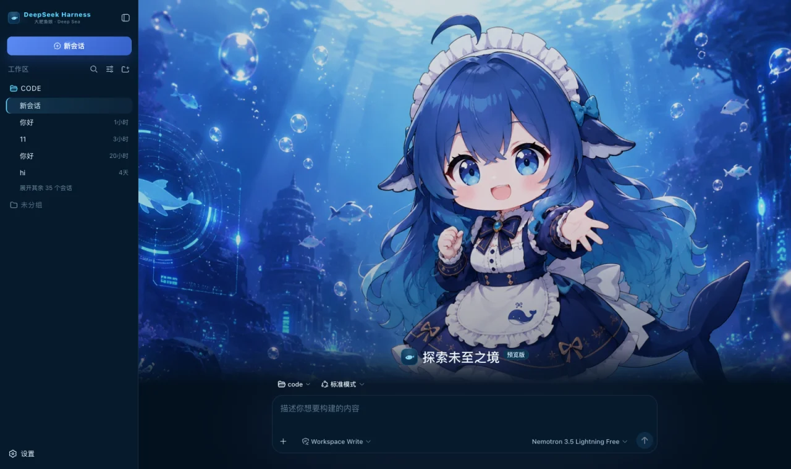
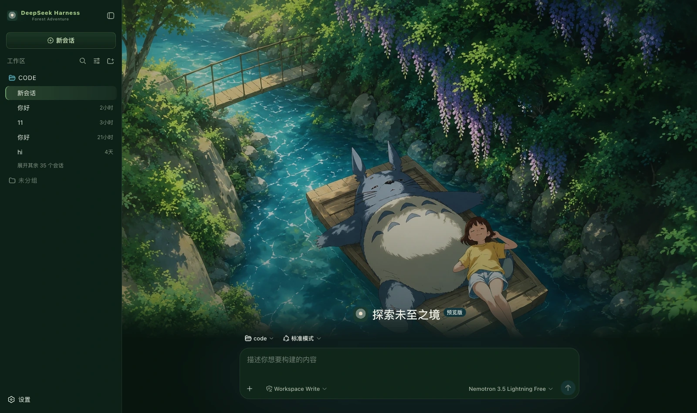
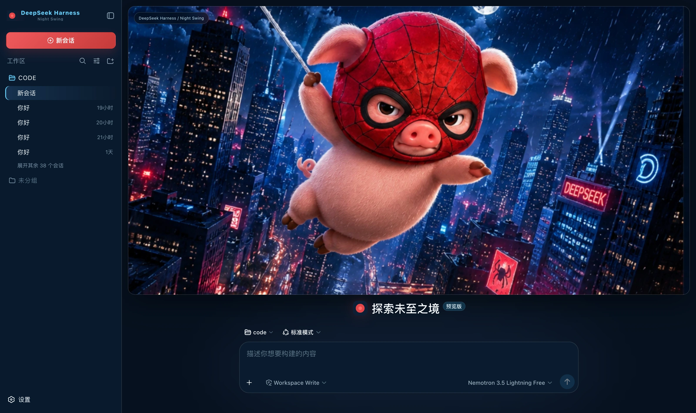
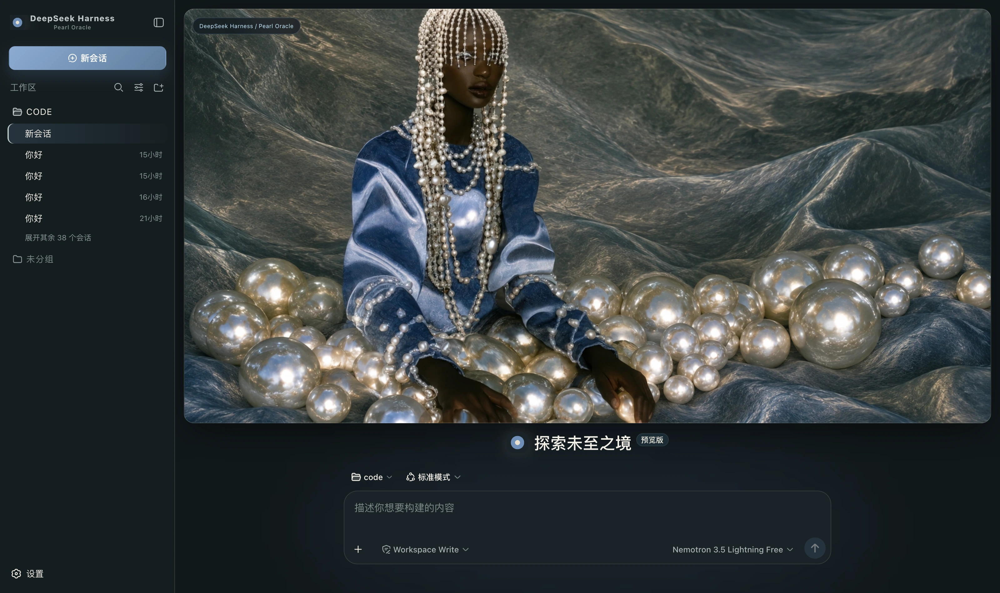
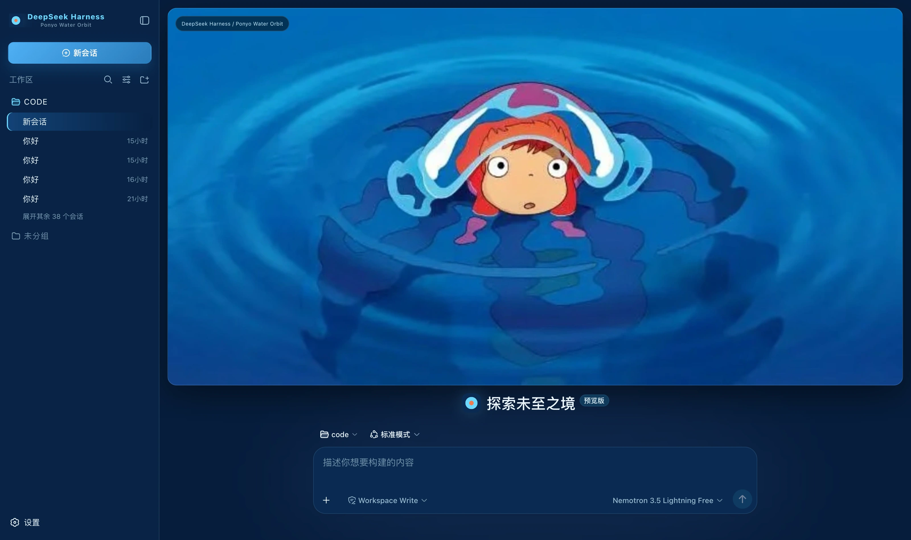
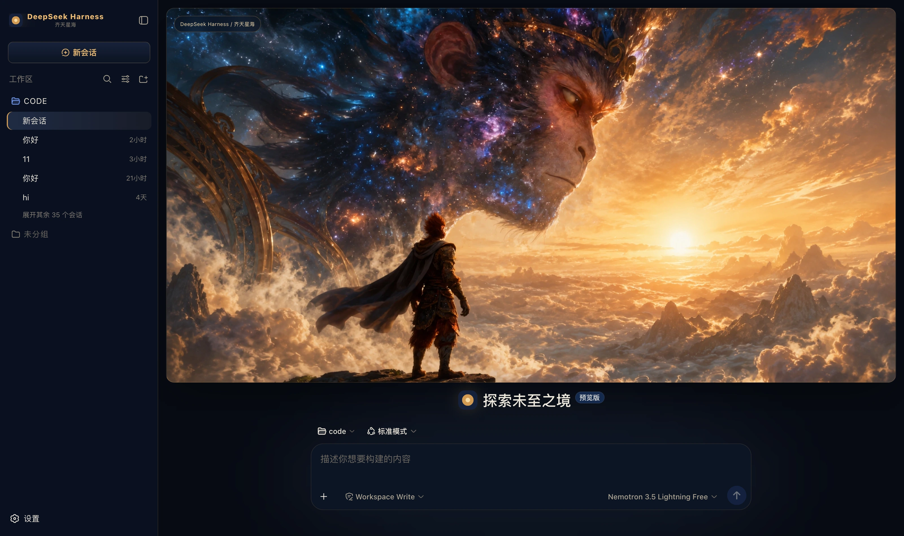
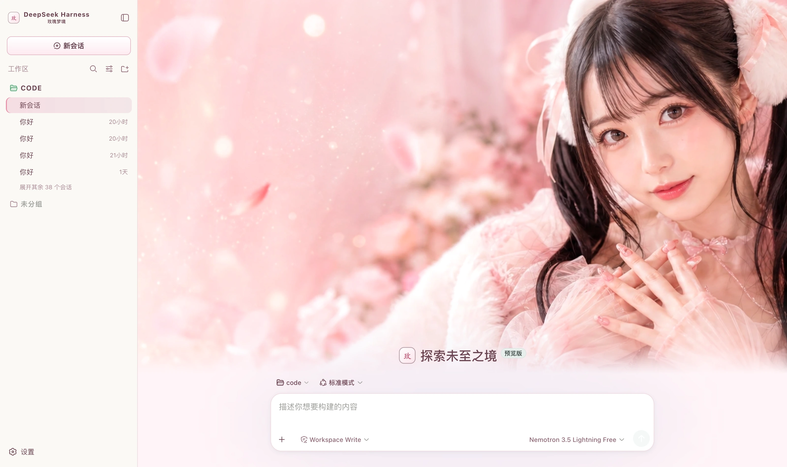
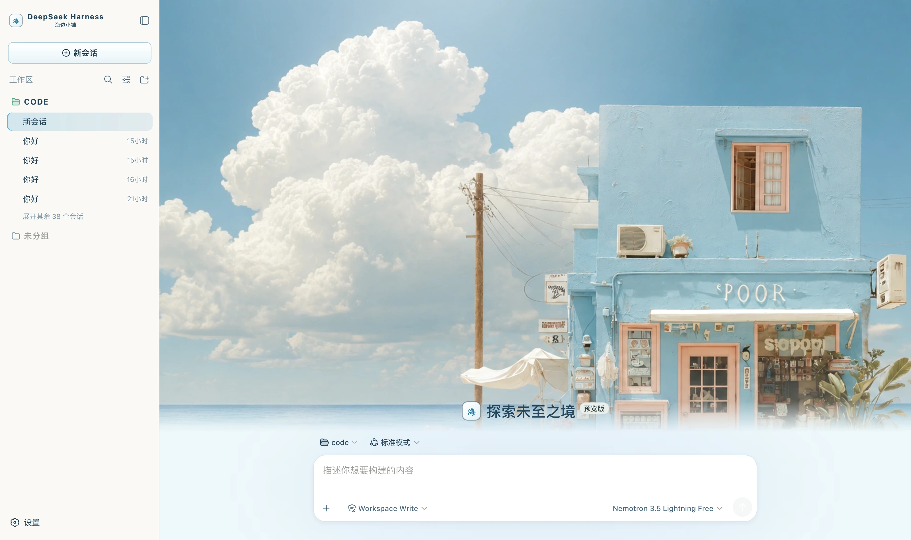

<h1 align="center">DSH Skin Pack</h1>

<p align="center">
  <strong>A whole shelf of skins for <a href="https://github.com/deepseek-ai/deepseek-harness">DeepSeek Harness</a>.</strong><br>
  One repository, many themes, each installed on its own.
</p>

<p align="center">
  <a href="https://dsh.a2hmarket.ai"><strong>dsh.a2hmarket.ai</strong></a>
  — see them in action, read the notes, install in one click, no login required
</p>

<p align="center">
  <a href="https://github.com/keman-ai/dsh-skin-pack"></a>
  <a href="https://github.com/keman-ai/dsh-skin-pack/releases"></a>
  
  <a href="LICENSE"></a>
</p>

<p align="center">
  <b>English</b> · <a href="README.zh-CN.md">简体中文</a>
</p>

<p align="center">
  <b>If this is useful to you, a Star goes a long way</b>
</p>

## Install

Start by browsing the [DSH skin market](https://dsh.a2hmarket.ai) — every skin has a full-screen preview and its design notes, and no login is required.

The easiest route is to install the [skin market plugin](https://github.com/keman-ai/dsh-skin-market) once; after that every skin is searched, installed and switched from inside dsh:

```sh
dsh plugin --profile web add -w github:keman-ai/dsh-skin-market
```

Restart dsh once, open **Settings → Skin Market**, and search, install and switch without going back to the terminal.

You can also install a single skin directly — find the version in [Releases](https://github.com/keman-ai/dsh-skin-pack/releases) and copy that `.tgz` URL:

```sh
dsh plugin --profile web add -w https://github.com/keman-ai/dsh-skin-pack/releases/download/<tag>/<package>-<version>.tgz
```

> **`-w` is not optional.** The profile directory ships a `pnpm-workspace.yaml`, so pnpm reads it as a workspace root and refuses to install with `ERR_PNPM_ADDING_TO_ROOT`. The flag is the "yes, install into the root" declaration.

**Why not `github:keman-ai/dsh-skin-pack`**: pnpm has no notion of installing from a subdirectory of a git repository, so a git spec pointing at this repo would pull the whole thing into your profile as a single package. Hence a separate tarball per skin.

## The skins

<!-- SKINS:BEGIN -->
<sub>30 skins. This section is generated by `scripts/readme.mjs` — do not edit by hand.</sub>

<table>
<tr>
<td width="33%" valign="top">
<a href="packages/dsh-ai-work-slogan"></a><br><b>AI Work Mode</b> <sub>dark</sub><br>
<sub>A deep-ocean blue gradient, frosted-glass panels and a white primary action; the empty screen is one slogan</sub><br>
<sub><code>packages/dsh-ai-work-slogan</code></sub>
</td>
<td width="33%" valign="top">
<a href="packages/dsh-blue-whale-ocean"></a><br><b>Blue Whale Ocean</b> <sub>dark</sub><br>
<sub>Deep-ocean blue ground, translucent cyan for borders and state, ice white for highlights alone; a whale-at-sea banner on the new-session page</sub><br>
<sub><code>packages/dsh-blue-whale-ocean</code></sub>
</td>
<td width="33%" valign="top">
<a href="packages/dsh-cosmic-exploration"></a><br><b>Cosmic Exploration</b> <sub>dark</sub><br>
<sub>A deep blue space ground with cool blue and nebula violet; a full cosmic-exploration cover on the new-session page</sub><br>
<sub><code>packages/dsh-cosmic-exploration</code></sub>
</td>
</tr>
<tr>
<td width="33%" valign="top">
<a href="packages/dsh-cosmic-opera"></a><br><b>Cosmic Opera</b> <sub>dark</sub><br>
<sub>A deep blue space ground with three accent steps in violet, blue and teal; a spiral-galaxy cover on the new-session page</sub><br>
<sub><code>packages/dsh-cosmic-opera</code></sub>
</td>
<td width="33%" valign="top">
<a href="packages/dsh-cyber-tao"></a><br><b>Cyber Tao</b> <sub>dark</sub><br>
<sub>Obsidian ground, bronze borders, rice-paper white text, cinnabar emphasis and jade state; a mountain-gate hero on the new-session page</sub><br>
<sub><code>packages/dsh-cyber-tao</code></sub>
</td>
<td width="33%" valign="top">
<a href="packages/dsh-dark-xianxia"></a><br><b>Dark Xianxia</b> <sub>dark</sub><br>
<sub>Ink-teal black ground, antique gold for edges and buttons, jade green only for running, cinnabar only for danger; a divination hero on the new-session page</sub><br>
<sub><code>packages/dsh-dark-xianxia</code></sub>
</td>
</tr>
<tr>
<td width="33%" valign="top">
<a href="packages/dsh-deepseek-deep-sea"></a><br><b>Whale Girl Deep Sea</b> <sub>dark</sub><br>
<sub>Deep-ocean blue ground, cool cyan for borders and state, DeepSeek blue for the primary action; a deep-sea hero on the new-session page</sub><br>
<sub><code>packages/dsh-deepseek-deep-sea</code></sub>
</td>
<td width="33%" valign="top">
<a href="packages/dsh-deepseek-twin-whale"></a><br><b>Twin Whale Girl</b> <sub>dark</sub><br>
<sub>Deep-ocean blue ground, cool cyan for borders and state, DeepSeek blue for the primary action; a twin whale-girl hero on the new-session page</sub><br>
<sub><code>packages/dsh-deepseek-twin-whale</code></sub>
</td>
<td width="33%" valign="top">
<a href="packages/dsh-emerald-megacity"></a><br><b>Emerald Megacity</b> <sub>dark</sub><br>
<sub>Ink-green ground, emerald for the primary action, jade green only for running, warm gold only for borders and emphasis</sub><br>
<sub><code>packages/dsh-emerald-megacity</code></sub>
</td>
</tr>
<tr>
<td width="33%" valign="top">
<a href="packages/dsh-extreme-xianxia-light"></a><br><b>Misty Xianxia</b> <sub>light</sub><br>
<sub>Paper and mist white ground, ink grey for text, pale gold for edges and buttons, jade green only for running; a xianxia hero on the new-session page</sub><br>
<sub><code>packages/dsh-extreme-xianxia-light</code></sub>
</td>
<td width="33%" valign="top">
<a href="packages/dsh-forest-adventure"></a><br><b>Forest Adventure</b> <sub>dark</sub><br>
<sub>Forest green ground, moss green for the primary action, stream teal only for running, daylight yellow as accent; a forest hero on the new-session page</sub><br>
<sub><code>packages/dsh-forest-adventure</code></sub>
</td>
<td width="33%" valign="top">
<a href="packages/dsh-forest-companion"></a><br><b>Forest Companion</b> <sub>dark</sub><br>
<sub>Deep forest green, soft cream and a touch of pink; a forest companion cover on the new-session page</sub><br>
<sub><code>packages/dsh-forest-companion</code></sub>
</td>
</tr>
<tr>
<td width="33%" valign="top">
<a href="packages/dsh-mars-flight-deck"></a><br><b>Mars Flight Deck</b> <sub>dark</sub><br>
<sub>Spaceflight black ground, cool blue for telemetry and borders, thruster orange for the primary action, Nominal green only for success; a flight-deck hero on the new-session page</sub><br>
<sub><code>packages/dsh-mars-flight-deck</code></sub>
</td>
<td width="33%" valign="top">
<a href="packages/dsh-night-flight-companion"></a><br><b>Night Flight Companion</b> <sub>dark</sub><br>
<sub>Deep night blue, moonlight cyan and a touch of warm cream; a night-flight banner on the new-session page</sub><br>
<sub><code>packages/dsh-night-flight-companion</code></sub>
</td>
<td width="33%" valign="top">
<a href="packages/dsh-night-forest-companion"></a><br><b>Night Forest Companion</b> <sub>dark</sub><br>
<sub>Moonlit night blue ground, moonlight cyan for borders and state, blue for the primary action; a night-forest banner on the new-session page</sub><br>
<sub><code>packages/dsh-night-forest-companion</code></sub>
</td>
</tr>
<tr>
<td width="33%" valign="top">
<a href="packages/dsh-night-swing"></a><br><b>Night Swing</b> <sub>dark</sub><br>
<sub>Rainy-night blue ground, combat red for the primary action, neon cyan only for running, and borders with no tint</sub><br>
<sub><code>packages/dsh-night-swing</code></sub>
</td>
<td width="33%" valign="top">
<a href="packages/dsh-niulai"></a><br><b>Niulai Field</b> <sub>dark</sub><br>
<sub>A warm-black field palette over a low-poly orange bull; a bull stands beneath your conversation</sub><br>
<sub><code>packages/dsh-niulai</code></sub>
</td>
<td width="33%" valign="top">
<a href="packages/dsh-pearl-oracle"></a><br><b>Pearl Oracle</b> <sub>dark</sub><br>
<sub>Warm grey stone ground, pearl white for highlights alone, silver borders, and misty blue as the only chromatic colour</sub><br>
<sub><code>packages/dsh-pearl-oracle</code></sub>
</td>
</tr>
<tr>
<td width="33%" valign="top">
<a href="packages/dsh-ponyo-water-orbit"></a><br><b>Ponyo Water Orbit</b> <sub>dark</sub><br>
<sub>Sea blue ground, bright blue for the primary action, water cyan only for running, coral as accent alone</sub><br>
<sub><code>packages/dsh-ponyo-water-orbit</code></sub>
</td>
<td width="33%" valign="top">
<a href="packages/dsh-qitian-cosmic-monkey"></a><br><b>Qitian Cosmic Monkey</b> <sub>dark</sub><br>
<sub>Midnight cosmic blue ground, ember gold for edges and the primary action, starlight blue only for running; a Monkey King hero on the new-session page</sub><br>
<sub><code>packages/dsh-qitian-cosmic-monkey</code></sub>
</td>
<td width="33%" valign="top">
<a href="packages/dsh-rose-dream"></a><br><b>Rose Dream</b> <sub>light</sub><br>
<sub>Pink-white ground, rose brown for body text, rose pink for the primary action, mint green only for success</sub><br>
<sub><code>packages/dsh-rose-dream</code></sub>
</td>
</tr>
<tr>
<td width="33%" valign="top">
<a href="packages/dsh-seaside-boutique"></a><br><b>Seaside Boutique</b> <sub>light</sub><br>
<sub>Sea-mist white ground, slate blue for body text, sky blue for the primary action, peach pink as accent alone</sub><br>
<sub><code>packages/dsh-seaside-boutique</code></sub>
</td>
<td width="33%" valign="top">
<a href="packages/dsh-summer-hillside"></a><br><b>Summer Hillside</b> <sub>light</sub><br>
<sub>Grass-white ground, deep grass green for body text, grass green for the primary action, sky blue for emphasis, seedhead pink as accent</sub><br>
<sub><code>packages/dsh-summer-hillside</code></sub>
</td>
<td width="33%" valign="top">
<a href="packages/dsh-sunset-catbus"></a><br><b>Sunset Catbus</b> <sub>dark</sub><br>
<sub>Deep brown ground, sunset orange for the primary action, wheat gold for borders and emphasis, cool blue only for running; a golden-hour banner on the new-session page</sub><br>
<sub><code>packages/dsh-sunset-catbus</code></sub>
</td>
</tr>
<tr>
<td width="33%" valign="top">
<a href="packages/dsh-twilight-city"></a><br><b>Twilight City</b> <sub>dark</sub><br>
<sub>Night-sky blue ground, sunset orange, purple and pink for atmosphere, warm yellow lighting only the buttons, sky blue only for running; a twilight-city hero on the new-session page</sub><br>
<sub><code>packages/dsh-twilight-city</code></sub>
</td>
<td width="33%" valign="top">
<a href="packages/dsh-ultra-team-apocalypse"></a><br><b>Ultra Team Apocalypse</b> <sub>dark</sub><br>
<sub>Charred black and dark red ground, firelight orange for the primary action, combat red only for failure, energy cyan only for running; an apocalypse-squad hero on the new-session page</sub><br>
<sub><code>packages/dsh-ultra-team-apocalypse</code></sub>
</td>
<td width="33%" valign="top">
<a href="packages/dsh-ultraman-cosmic-hero"></a><br><b>Cosmic Hero</b> <sub>dark</sub><br>
<sub>Deep-space blue-black with the three colour-timer colours; a cosmic-hero visual on the new-session page</sub><br>
<sub><code>packages/dsh-ultraman-cosmic-hero</code></sub>
</td>
</tr>
<tr>
<td width="33%" valign="top">
<a href="packages/dsh-whale-girl"></a><br><b>Whale Girl Lounge</b> <sub>light</sub><br>
<sub>A three-step palette of pale blue, pearl white and deep-ocean blue; a whale-girl cover on the new-session page</sub><br>
<sub><code>packages/dsh-whale-girl</code></sub>
</td>
<td width="33%" valign="top">
<a href="packages/dsh-whale-wave-banner"></a><br><b>Whale Wave Banner</b> <sub>light</sub><br>
<sub>DeepSeek blue and white; a banner cover on the new-session page with the composer separately below</sub><br>
<sub><code>packages/dsh-whale-wave-banner</code></sub>
</td>
<td width="33%" valign="top">
<a href="packages/dsh-wukong-flame-mountain"></a><br><b>Black Myth Wukong · Flame Mountain</b> <sub>dark</sub><br>
<sub>Black ink, antique gold and ember orange; a burning-mountain hero on the new-session page</sub><br>
<sub><code>packages/dsh-wukong-flame-mountain</code></sub>
</td>
</tr>
</table>
<!-- SKINS:END -->

## Development

```sh
pnpm install
pnpm verify   # consistency gates: three ids aligned, files covers the entry, no theme-id collisions
pnpm check    # type check
pnpm build    # full build (about 0.1s per package, a few seconds for the repo)
```

The skins have no dependencies on each other, so there is no incremental build — a full one is fast enough that the complexity would buy nothing.

To publish a change to one skin, bump the `version` in its `package.json`: CI decides what to publish by whether a version already has a matching Release tag, and skips every package whose version was not bumped.

```sh
pnpm release --dry   # show what would be published without touching the remote
```

### Directory layout

```
packages/<name>/     ← the package is always dsh-<name>; the scripts and the market data both rely on that mapping
├── skin.json        ← the skin's self-description; its id must match cordis.patch.yml and THEME_ID
├── cordis.patch.yml ← inserts the skin into the Loader tree; without it the plugin is never loaded
├── package.json     ← dsh.bundle.patch points at the patch; files decides what goes into the tarball
├── src/             ← the host half (src/index.ts) and the client half (src/client/)
├── preview/         ← preview images, used by the market and by the wall above
└── lib/             ← build output; kept out of git, built by CI and packed into the tarball
```

Not committing `lib/` is the biggest difference from the standalone-repository era: back then skins installed via `github:owner/repo` and what you installed was the output in the repository, so leaving it out shipped an empty shell. Now that distribution goes through Release tarballs, `npm pack` packs the built `lib/` according to `files`, and committing it would only bloat the repository.

## Want to build your own?

The fastest route is to copy any skin under `packages/` — they all share one structure, and `skin.json`, `cordis.patch.yml` and `src/client/tokens.ts` are the whole entry point.

When it is ready, you are welcome to publish it on the [DSH skin market](https://dsh.a2hmarket.ai), where anyone can browse and install without logging in.

## License

[MIT](LICENSE) © Science Roam Limited

---

<p align="center">
  <sub>If this is useful to you, a Star goes a long way</sub>
</p>
