<h1 align="center">DSH Skin Pack</h1>

<p align="center">
  <strong>给 <a href="https://github.com/deepseek-ai/deepseek-harness">DeepSeek Harness</a> 的一整套皮肤。</strong><br>
  一个仓库，一批主题，各自独立安装。
</p>

<p align="center">
  <a href="LICENSE"></a>
  
</p>

## 怎么装

最省事的办法是先装一次[皮肤市场](https://github.com/keman-ai/dsh-skin-market)，之后所有皮肤都在 dsh 界面里点：

```sh
dsh plugin --profile web add -w github:keman-ai/dsh-skin-market
```

重启一次 dsh，打开**设置 → 皮肤市场**，搜索、安装、切换，全部不用再回终端。

也可以直接装单个皮肤——在 [Releases](../../releases) 里找到对应版本，复制那个 `.tgz` 的地址：

```sh
dsh plugin --profile web add -w https://github.com/keman-ai/dsh-skin-pack/releases/download/<tag>/<包名>-<版本>.tgz
```

> `-w` 不能省：profile 目录自带 `pnpm-workspace.yaml`，pnpm 因此认定它是 workspace 根并以 `ERR_PNPM_ADDING_TO_ROOT` 拒绝安装。这个 flag 就是「我确实要装到根」。

**为什么不是 `github:keman-ai/dsh-skin-pack`**：pnpm 没有「从 git 仓库子目录安装」这回事，指向本仓库的 git spec 会把 28 套皮肤当成一个包装进你的 profile。所以这里发的是每套皮肤各自的 tarball。

## 皮肤一览

<!-- SKINS:BEGIN -->
<sub>共 28 套皮肤，本段由 `scripts/readme.mjs` 生成，请勿手改。</sub>

<table>
<tr>
<td width="33%" valign="top">
<a href="packages/ai-work-slogan"></a><br><b>AI 工作模式</b> <sub>暗色</sub><br>
<sub>深海蓝渐变 + 毛玻璃面板 + 白色主操作，空屏是一句口号</sub><br>
<sub><code>packages/ai-work-slogan</code></sub>
</td>
<td width="33%" valign="top">
<a href="packages/blue-whale-ocean">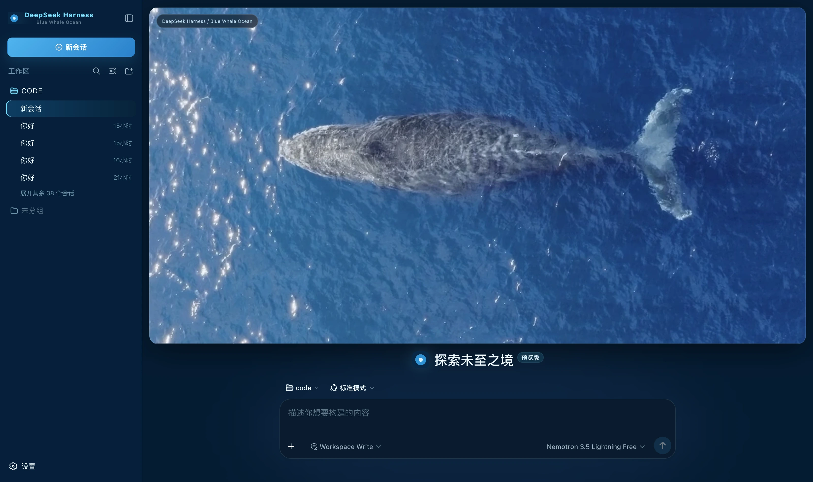</a><br><b>蓝鲸海洋</b> <sub>暗色</sub><br>
<sub>深海蓝打底、透明青蓝做描边与状态、冰白只做高光，新会话页是一整幅鲸鱼海面横幅</sub><br>
<sub><code>packages/blue-whale-ocean</code></sub>
</td>
<td width="33%" valign="top">
<a href="packages/cosmic-exploration"></a><br><b>宇宙探索</b> <sub>暗色</sub><br>
<sub>深蓝太空底 + 冷蓝与星云紫，新会话页是一整幅宇宙探索封面</sub><br>
<sub><code>packages/cosmic-exploration</code></sub>
</td>
</tr>
<tr>
<td width="33%" valign="top">
<a href="packages/cosmic-opera"></a><br><b>宇宙歌剧</b> <sub>暗色</sub><br>
<sub>深蓝太空底 + 紫/蓝/青三档强调，新会话页是一整幅旋涡星系封面</sub><br>
<sub><code>packages/cosmic-opera</code></sub>
</td>
<td width="33%" valign="top">
<a href="packages/cyber-tao">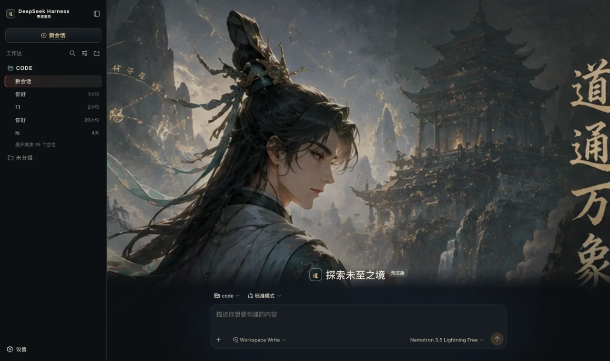</a><br><b>赛博道观</b> <sub>暗色</sub><br>
<sub>黑曜石底、青铜描边、宣纸白文字，朱砂强调、玉石青状态，新会话页是一整幅山门主视觉</sub><br>
<sub><code>packages/cyber-tao</code></sub>
</td>
<td width="33%" valign="top">
<a href="packages/dark-xianxia"></a><br><b>天机阁·修仙版</b> <sub>暗色</sub><br>
<sub>墨青黑打底、古金做边与按钮、玉青只给运行中、朱砂只给危险，新会话页是一整幅召请天机主视觉</sub><br>
<sub><code>packages/dark-xianxia</code></sub>
</td>
</tr>
<tr>
<td width="33%" valign="top">
<a href="packages/deepseek-fish-maid"></a><br><b>大鱼娘 Deep Sea</b> <sub>暗色</sub><br>
<sub>深海蓝打底、冷青做描边与状态、DeepSeek 蓝做主操作，新会话页是一整幅深海主视觉</sub><br>
<sub><code>packages/deepseek-fish-maid</code></sub>
</td>
<td width="33%" valign="top">
<a href="packages/deepseek-twin-whale-maid">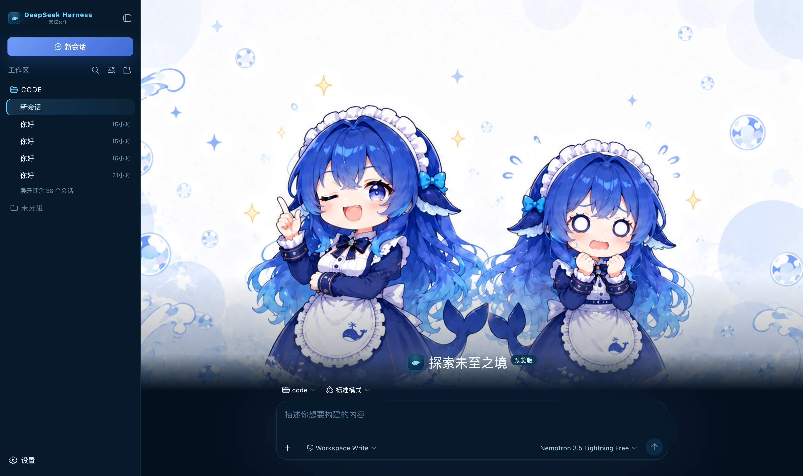</a><br><b>双鲸女仆</b> <sub>暗色</sub><br>
<sub>深海蓝打底、冷青做描边与状态、DeepSeek 蓝做主操作，新会话页是一整幅双子女仆主视觉</sub><br>
<sub><code>packages/deepseek-twin-whale-maid</code></sub>
</td>
<td width="33%" valign="top">
<a href="packages/emerald-megacity">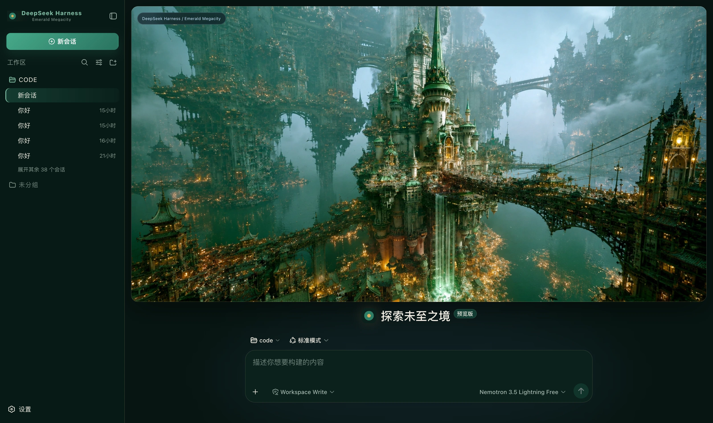</a><br><b>翡翠巨城</b> <sub>暗色</sub><br>
<sub>墨绿打底、翡翠做主操作、玉青只给运行中、暖金只做描边与强调</sub><br>
<sub><code>packages/emerald-megacity</code></sub>
</td>
</tr>
<tr>
<td width="33%" valign="top">
<a href="packages/extreme-xianxia-light">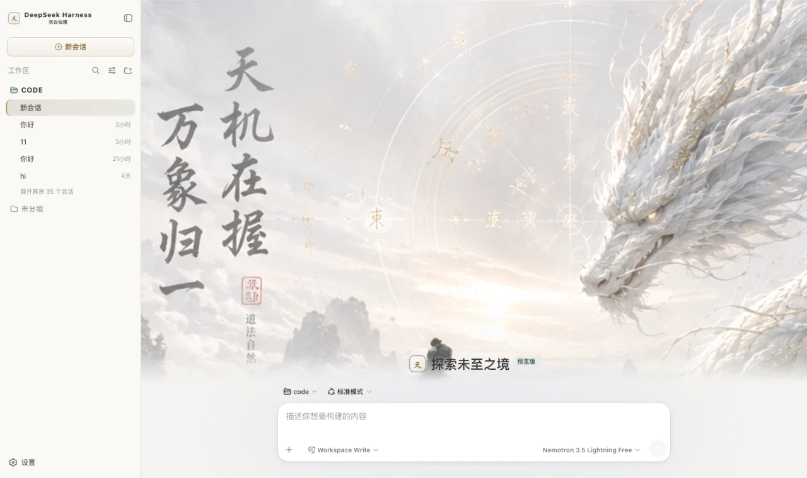</a><br><b>灰白仙境</b> <sub>浅色</sub><br>
<sub>纸白雾白打底、墨灰做文字、淡金做边与按钮、玉青只给运行中，新会话页是一整幅天机在握主视觉</sub><br>
<sub><code>packages/extreme-xianxia-light</code></sub>
</td>
<td width="33%" valign="top">
<a href="packages/forest-adventure"></a><br><b>森林漫游</b> <sub>暗色</sub><br>
<sub>森林深绿打底、苔藓绿做主操作、溪水青只给运行中、日光黄只做点缀，新会话页是一整幅林间主视觉</sub><br>
<sub><code>packages/forest-adventure</code></sub>
</td>
<td width="33%" valign="top">
<a href="packages/forest-companion"></a><br><b>森林同行</b> <sub>暗色</sub><br>
<sub>深森林绿 + 柔和米色 + 一点粉，新会话页是一整幅森林陪伴封面</sub><br>
<sub><code>packages/forest-companion</code></sub>
</td>
</tr>
<tr>
<td width="33%" valign="top">
<a href="packages/mars-flight-deck"></a><br><b>火星驾驶舱</b> <sub>暗色</sub><br>
<sub>航天黑打底、冷蓝做遥测与描边、推进器橙做主操作、Nominal 绿只给成功，新会话页是一整幅驾驶舱主视觉</sub><br>
<sub><code>packages/mars-flight-deck</code></sub>
</td>
<td width="33%" valign="top">
<a href="packages/night-flight-companion">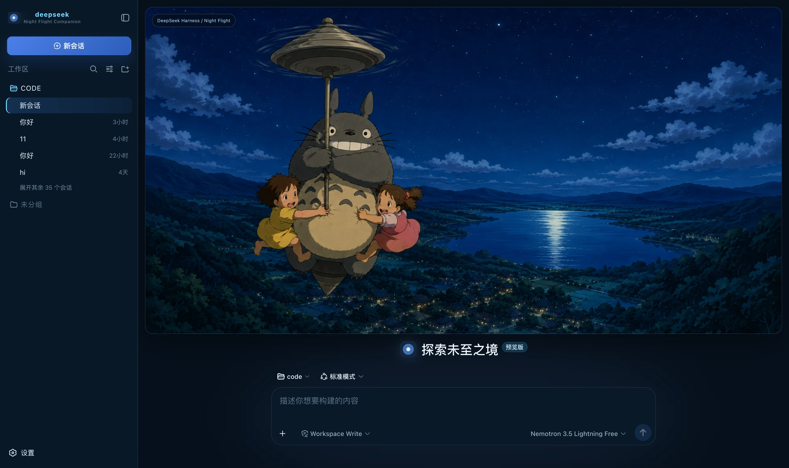</a><br><b>夜航同行</b> <sub>暗色</sub><br>
<sub>深夜蓝 + 月光青 + 一点暖米色，新会话页是一整幅夜空飞行横幅</sub><br>
<sub><code>packages/night-flight-companion</code></sub>
</td>
<td width="33%" valign="top">
<a href="packages/night-forest-companion"></a><br><b>夜林同伴</b> <sub>暗色</sub><br>
<sub>月夜蓝打底、月光青做描边与状态、主操作走蓝，新会话页是一整幅夜林横幅</sub><br>
<sub><code>packages/night-forest-companion</code></sub>
</td>
</tr>
<tr>
<td width="33%" valign="top">
<a href="packages/niulai"></a><br><b>牛来原野</b> <sub>暗色</sub><br>
<sub>暖黑原野配色 + 低模橙牛背景，一头牛站在你的对话底下</sub><br>
<sub><code>packages/niulai</code></sub>
</td>
<td width="33%" valign="top">
<a href="packages/pearl-oracle"></a><br><b>珍珠神谕</b> <sub>暗色</sub><br>
<sub>暖灰石打底、珍珠白只做高光、银做描边、雾蓝是全场唯一的彩色</sub><br>
<sub><code>packages/pearl-oracle</code></sub>
</td>
<td width="33%" valign="top">
<a href="packages/ponyo-water-orbit"></a><br><b>波妞水面</b> <sub>暗色</sub><br>
<sub>海蓝打底、亮蓝做主操作、水青只给运行中、珊瑚色只做点缀</sub><br>
<sub><code>packages/ponyo-water-orbit</code></sub>
</td>
</tr>
<tr>
<td width="33%" valign="top">
<a href="packages/qitian-cosmic-monkey"></a><br><b>齐天星海</b> <sub>暗色</sub><br>
<sub>深夜宇宙蓝打底、余烬金做边与主操作、星辉蓝只给运行中，新会话页是一整幅大圣星海主视觉</sub><br>
<sub><code>packages/qitian-cosmic-monkey</code></sub>
</td>
<td width="33%" valign="top">
<a href="packages/seaside-boutique"></a><br><b>海边小铺</b> <sub>浅色</sub><br>
<sub>海雾白打底、灰蓝做正文、天空蓝做主操作、蜜桃粉只做点缀</sub><br>
<sub><code>packages/seaside-boutique</code></sub>
</td>
<td width="33%" valign="top">
<a href="packages/summer-hillside">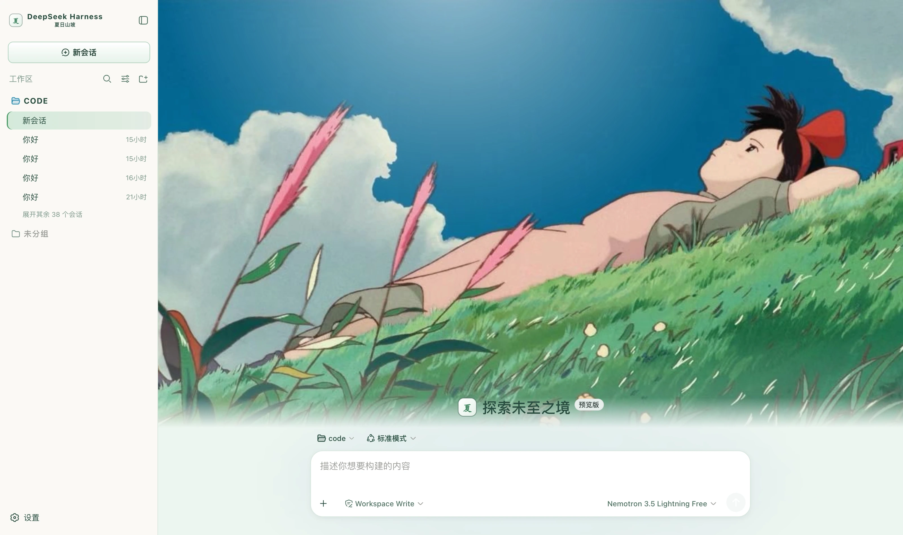</a><br><b>夏日山坡</b> <sub>浅色</sub><br>
<sub>草白打底、深草绿做正文、草绿做主操作、天蓝做强调、穗粉只做点缀</sub><br>
<sub><code>packages/summer-hillside</code></sub>
</td>
</tr>
<tr>
<td width="33%" valign="top">
<a href="packages/sunset-catbus"></a><br><b>夕阳猫巴士</b> <sub>暗色</sub><br>
<sub>深棕打底、夕阳橙做主操作、麦田金做描边与强调、冷蓝只给运行中，新会话页是一整幅黄昏横幅</sub><br>
<sub><code>packages/sunset-catbus</code></sub>
</td>
<td width="33%" valign="top">
<a href="packages/twilight-city">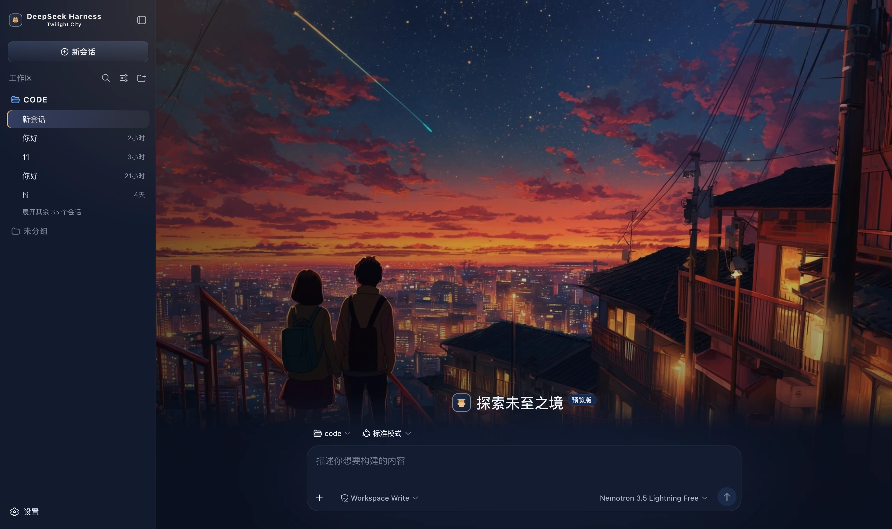</a><br><b>黄昏城市</b> <sub>暗色</sub><br>
<sub>深蓝夜空打底、晚霞橙紫粉做氛围、暖黄只点亮按钮、天空蓝只给运行中，新会话页是一整幅黄昏城市主视觉</sub><br>
<sub><code>packages/twilight-city</code></sub>
</td>
<td width="33%" valign="top">
<a href="packages/ultra-team-apocalypse">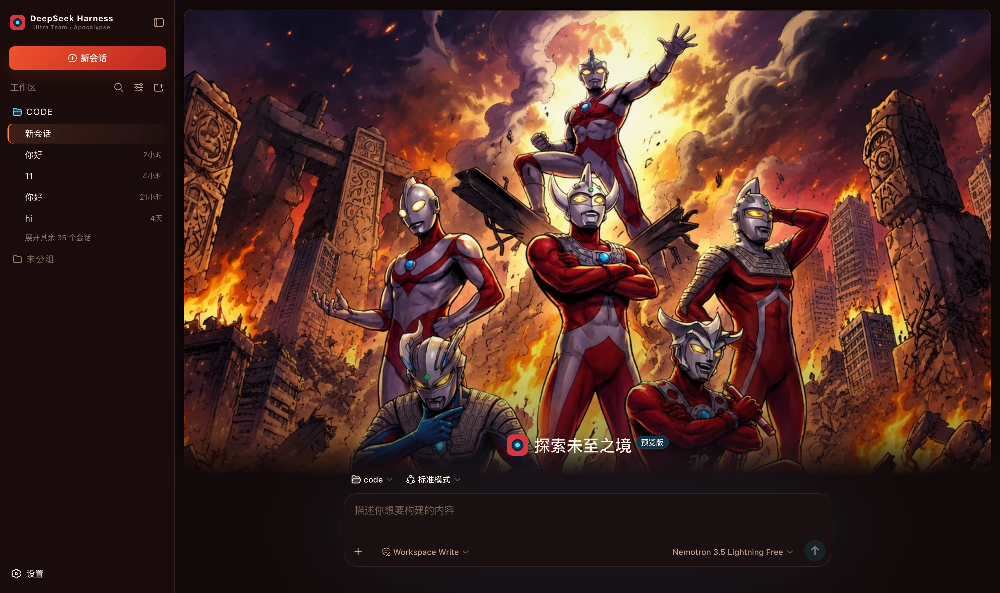</a><br><b>奥特小队·末日</b> <sub>暗色</sub><br>
<sub>焦黑暗红打底、火光橙做主操作、战斗红只给失败、能量青只给运行中，新会话页是一整幅末日小队主视觉</sub><br>
<sub><code>packages/ultra-team-apocalypse</code></sub>
</td>
</tr>
<tr>
<td width="33%" valign="top">
<a href="packages/ultraman-cosmic-hero">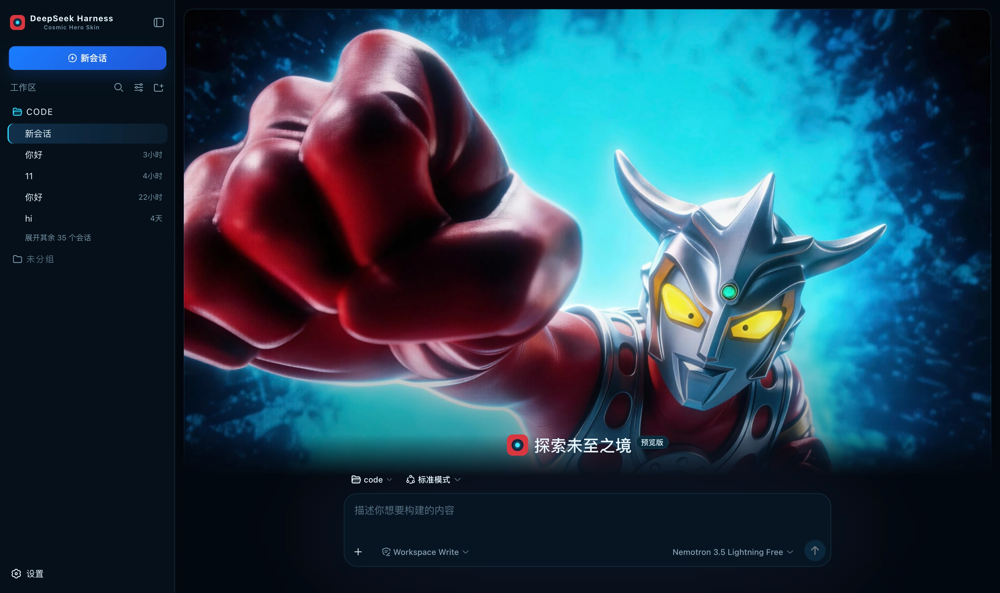</a><br><b>宇宙英雄</b> <sub>暗色</sub><br>
<sub>深空蓝黑配彩色计时器三色，新会话页是一整幅宇宙英雄主视觉</sub><br>
<sub><code>packages/ultraman-cosmic-hero</code></sub>
</td>
<td width="33%" valign="top">
<a href="packages/whale-girl"></a><br><b>鲸鱼娘海岸休息室</b> <sub>浅色</sub><br>
<sub>浅蓝、珍珠白与深海蓝的三级配色，新会话页是一整幅鲸鱼娘封面</sub><br>
<sub><code>packages/whale-girl</code></sub>
</td>
<td width="33%" valign="top">
<a href="packages/whale-wave-banner">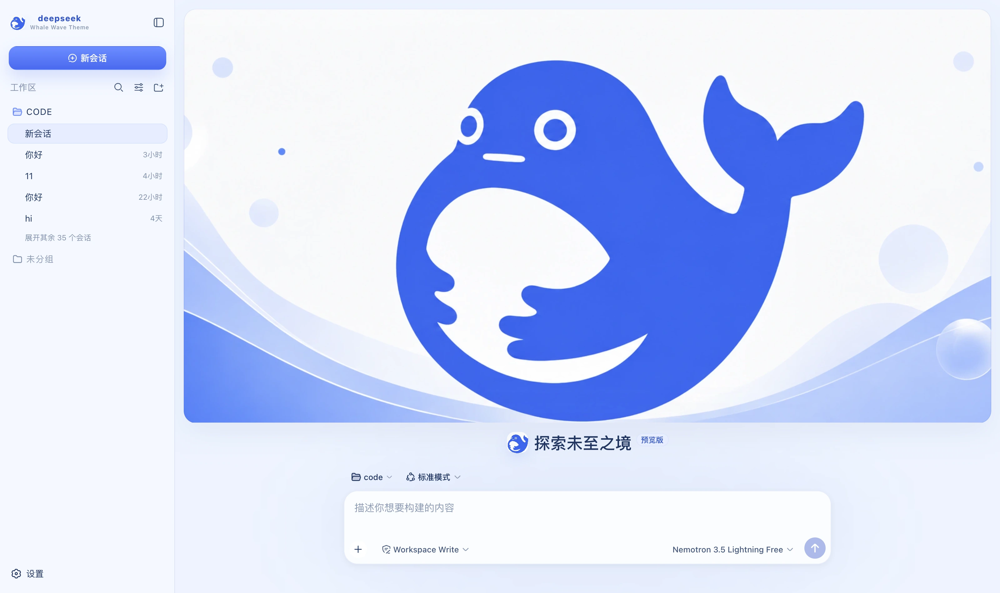</a><br><b>鲸跃横幅</b> <sub>浅色</sub><br>
<sub>DeepSeek 蓝 + 白，新会话页是一张横幅封面，输入区独立在下方</sub><br>
<sub><code>packages/whale-wave-banner</code></sub>
</td>
</tr>
<tr>
<td width="33%" valign="top">
<a href="packages/wukong-flame-mountain"></a><br><b>黑神话悟空 · 焚山版</b> <sub>暗色</sub><br>
<sub>黑墨、古金与余烬橙，新会话页是一整幅焚山主视觉</sub><br>
<sub><code>packages/wukong-flame-mountain</code></sub>
</td>
</tr>
</table>
<!-- SKINS:END -->

## 开发

```sh
pnpm install
pnpm verify   # 一致性闸：三处 id 对齐、files 覆盖入口、主题 id 不撞
pnpm check    # 类型检查
pnpm build    # 全量构建（28 个包约 3 秒）
```

皮肤之间零依赖，所以不做增量构建——全量太快了，增量的复杂度换不来什么。

改一套皮肤要发布时，把它 `package.json` 的 `version` 提一格即可：CI 按「版本号有没有对应的 Release tag」决定发谁，没提版本的包一律跳过。

```sh
pnpm release --dry   # 看这次会发哪些，不动远端
```

### 目录约定

```
packages/<name>/     ← 包名固定是 dsh-<name>，脚本与集市数据都依赖这个映射
├── skin.json        ← 皮肤自描述；它的 id 必须与 cordis.patch.yml、THEME_ID 三处一致
├── cordis.patch.yml ← 把自己插进 Loader 树，没有它插件永远不会被加载
├── package.json     ← dsh.bundle.patch 指向 patch；files 决定哪些进 tarball
├── src/             ← host 半 (src/index.ts) + client 半 (src/client/)
├── preview/         ← 预览图，集市与本页截图墙用
└── lib/             ← 构建产物，不进 git，由 CI 构建后打进 tarball
```

`lib/` 不提交是与独立仓时代最大的区别：那时皮肤靠 `github:owner/repo` 安装，装的就是仓库里的产物，不提交别人装到的是空壳。改走 Release tarball 之后 `npm pack` 会把构建好的 `lib/` 按 `files` 打进包，提交它只会让仓库白白变大。

皮肤本身怎么写（主题注册、slot、装饰只在激活时存在、集市安装期的几道闸），见 [dsh-skin-dev](https://github.com/keman-ai/dsh-skin-dev)。

## License

[MIT](LICENSE) © Science Roam Limited
