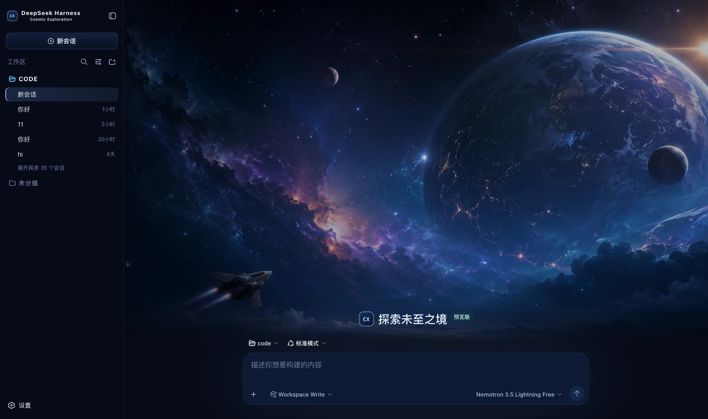

# dsh-cosmic-exploration · Cosmic Exploration

A skin for DeepSeek Harness (dsh): a deep blue space ground with cool blue and nebula violet, and a full cosmic-exploration cover on the new-session page.



## What it changes

| Surface | Content |
|---|---|
| Palette | A deep blue space ground (#050814) with three blue-black panel levels; borders split two ways — cool blue for broad layering and nebula violet for emphasis |
| Global | A 14% starfield layer (the four scattered points from the prototype's `body:before`). Without it the interface is just a field of deep blue |
| New session | A full-screen cover: two nebula glows, scrims left and right and a darkening from the bottom up, with the composer pinned to the bottom over the image |
| Brand slots | The sidebar and new-session marks become a mission badge (a deep blue gradient square, a cool blue border and the monospace code `CX`), subtitled `Cosmic Exploration` |
| Persona copy | Thinking → `Charting the unknown…`; failure → `Navigation anomaly detected.` |
| 右侧状态台 | 对话页常驻：缩小版封面 + 六类真实状态，可收起（记住选择） |

### 🔴 The warm tone is for states, never buttons

The Theme rules in the prototype's Appearance panel are explicit: deep blue space as the main ground, cool blue and violet nebula as the visual climax, and
**a small amount of warm colour for important states and the mission button only**. New Mission uses the full-screen cosmic-exploration cover, while Console / Trajectory
return to a low-distraction, genuinely usable Harness product interface.

In implementation:

- **the primary action is solid nebula violet** (the hero's `START EXPLORATION →` is a violet gradient in the prototype),
  while New session is a deep blue gradient with a cool blue border — once an accent spreads, it stops meaning "the one that matters most";
- **the warm tones (#ffb772 / #f0b46d) are reserved for states that need your attention** and never appear on an ordinary button;
- **running uses the Glow cool blue `#61d0ff`**: the brightest thing in all this deep blue, without competing with the violet primary action;
- the cover is drawn on the hero only, with none of it on the chat or trajectory pages — the prototype requires those two to stay low-distraction and genuinely usable.

### What the status dock shows

| Card | Fields | Source |
|---|---|---|
| Waiting on you | Tools awaiting approval, questions awaiting an answer | `ConversationSnapshot.pending`. **Appears only when something is genuinely waiting** |
| Current Session | State, elapsed turn time, current tool duration, inbox, model | `running` / `turnTimings` / `runningCalls` / `queue`; the model comes from the latest assistant message's `provenance.model` |
| Context | Occupancy %, token load, and the System / tool-schema / conversation composition bar | The `contextPressure` and `contextBreakdown` projections |
| Permission | The active permission and sandbox mode | The `permissions` projection |
| Usage | Input / output / cache hits / time spent / turns | The `tokenUsage` and `sessionStats` projections |
| Plan | Todo progress | The `todos` projection (the card is absent when there is no list) |
| SHIP SYSTEMS | Tool name · real duration · outcome | Trajectory `tool-result` nodes (duration = `time - callTime`) plus the snapshot's `runningCalls`. **Appears only once a call has happened** |
| CONTEXT FEED | The source and form of each context injection | Trajectory `context` nodes (`provenance.label` / `form`) |
| COMPACTED | Compaction count, items and tokens folded | Trajectory `compaction` nodes. **Absent when nothing was compacted** |

⚠️ **A tool duration may be absent**: it can only be computed while the matching `tool/call` is still inside the session window. Older calls that scrolled past report only name and outcome — better blank than an invented figure.

⚠️ **Composition is not a total**: the three `contextBreakdown` figures use fixed-density estimates (systematically low for Chinese and JSON schema)
and **do not add up** to the token load, which is anchored to the provider's reported value. The UI says so too.

## Deliberately not done

Of the four cards in the prototype's right column only `Current Mission` maps to real data; the rest are hardcoded decoration
with no matching projection in the harness, and none are built — **decoration is fine; fake state is not**:

- the five `ONLINE` / `SYNCED` / `STANDBY` rows under Ship Systems
- the Signal 97.2% and Route score 82 under Telemetry
- the static shortcut cheat sheet under Shortcuts
- the four mission parameters at the left of the hero (Mission / Sector / Signal Strength / Jump Window)

Of the six agent-copy lines only the two with an anchor are built: `Tool / Context / Success` have no intermediate state to attach to in the harness
(a tool row has only ok and error, with no running), and nothing is forced.

## Install

**Skin market** (recommended): find it in the market and install, then **restart dsh**.

Manual install (during development):

```bash
npm install && npm run build
DST=~/.dsh/profiles/web/node_modules/dsh-cosmic-exploration
mkdir -p "$DST" && cp -R lib cordis.patch.yml skin.json package.json README.md "$DST/"
# then add dsh-cosmic-exploration to the profile package.json's dependencies and dsh.profile.bundles
```

After changing it you **must restart dsh**: the profile tree has to be recomposed, and without a restart the UI stays as it was.

## 🔴 The side effect of autoApply

Installing switches to this skin by default (`autoApply`, default `true`). The reason is that the harness **does not persist third-party theme ids**,
and the **built-in Settings → Appearance has only three cells: light / dark / follow system**, with no third-party themes —
switching manually requires the skin market's own panel (**Settings → Skin Market**).

The cost: **it reapplies on every refresh**, so switching away lasts only for that session. To change permanently, set `autoApply` to `false`
or uninstall the plugin. It is implemented as an 8-second window after startup (long enough to outlast the Host preference snapshot), after which it lets go entirely.

## Version requirements

Requires **dsh 0.1.1-rc.2 or newer**. The brand-slot takeover relies on slot `priority` shadowing (only equal
priorities count as a conflict; different priorities shadow, and the lower number renders). On older versions these three registrations throw and are swallowed,
**merely falling back to the official brand mark**, while the palette and cover keep working.

## Assets

The cover is a 1672×941 illustration compressed to webp (q92, 222 KB) and inlined into the bundle rather than linked from an image host — it has to work offline and on an intranet. How it is generated and its resolution ceiling are documented at the top of `src/client/cover.generated.ts`.

## Development

```bash
npm run check   # tsc --noEmit
npm run build   # produces lib/index.js (host half) and lib/client.js (browser half)
```

`lib/` **must be committed**: skins install via `github:owner/repo`, which installs the build output from the repository;
if the source moves and the output does not, people install the old version (and the market uninstalls the package outright over the missing entry file).

## License

MIT © Science Roam Limited
