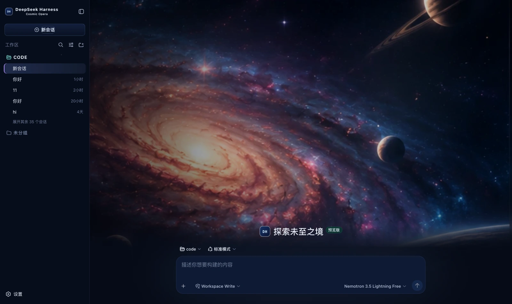

# dsh-cosmic-opera · Cosmic Opera

A skin for DeepSeek Harness (dsh): a deep blue space ground with three accent steps in violet, blue and teal, and a full spiral-galaxy cover on the new-session page.



## What it changes

| Surface | Content |
|---|---|
| Palette | A deep blue space ground (#050814) with three blue-black panel levels; borders split two ways — cool blue for broad layering and nebula violet for emphasis |
| Global | A 14% starfield layer. Without it the interface is just a field of deep blue |
| New session | A full-screen spiral-galaxy cover: two nebula glows, scrims left and right and a darkening from the bottom up, with the composer pinned to the bottom over the image |
| Brand slots | The sidebar and new-session marks become a mission badge (a deep blue gradient square, a cool blue border and the monospace code `DH`), subtitled `Cosmic Opera` |
| Persona copy | Thinking → `Charting the unknown…`; failure → `Navigation anomaly detected.` |
| Status dock | Always present on the chat page: a reduced cover plus six kinds of real state, collapsible (the choice is remembered) |

### All the epic weight goes on the cover; the interface stays restrained

The prototype's Theme rules put it directly: this leans **cosmic opera and the epic** — the visual weight sits on the spiral galaxy, the planetary arc,
the deep-space glow and the narrative of exploration, **while outside New Mission the interface keeps the real Harness product structure and density**.

So there are only three accent steps, each with its own place:

- **violet** (#8e73ff) = the solid primary action, while New session is a deep blue gradient with a cool blue border;
- **blue** (#79c2ff) = borders and data;
- **teal** (#75d4cb) = running. The prototype puts it on telemetry values; here it lands on the running state
  so that running stays clear of both the blue data and the violet primary action;
- the warm #ffb775 is **reserved for states that need your attention** and never appears on an ordinary button.

The cover is drawn on the hero only, with none of it on the chat or trajectory pages.

### 🔴 The cover is cropped out of a UI concept mockup

The cover the prototype supplies **is itself a screenshot of a whole UI concept** (1536×1024, containing a fake sidebar, a fake mission panel
and a "New Mission" title printed onto the art). Using it directly as the hero background gives you **an interface inside an interface** — the screenshot
really does show two layers of UI stacked on each other.

So the mockup's shell is cropped away, leaving only the art:

```bash
cwebp -q 92 -crop 665 0 600 700 cover.png -o cover.webp
```

The first pass cropped from x=600 and still left the tail of the "UNDERSTAND." line on the left edge; moving 65px further right finally cleared it.

### What the status dock shows

| Card | Fields | Source |
|---|---|---|
| Waiting on you | Tools awaiting approval, questions awaiting an answer | `ConversationSnapshot.pending`. **Appears only when something is genuinely waiting** |
| Current Session | State, elapsed turn time, current tool duration, inbox, model | `running` / `turnTimings` / `runningCalls` / `queue`; the model comes from the latest assistant message's `provenance.model` |
| Context | Occupancy %, token load, and the System / tool-schema / conversation composition bar | The `contextPressure` and `contextBreakdown` projections |
| Permission | The active permission and sandbox mode | The `permissions` projection |
| Usage | Input / output / cache hits / time spent / turns | The `tokenUsage` and `sessionStats` projections |
| Plan | Todo progress | The `todos` projection (the card is absent when there is no list) |
| Tool calls | Tool name · real duration · outcome | Trajectory `tool-result` nodes (duration = `time - callTime`) plus the snapshot's `runningCalls`. **Appears only once a call has happened** |
| Context injections | The source and form of each injection | Trajectory `context` nodes (`provenance.label` / `form`) |
| Folded away | Compaction count, items and tokens folded | Trajectory `compaction` nodes. **Absent when nothing was compacted** |

⚠️ **A tool duration may be absent**: it can only be computed while the matching `tool/call` is still inside the session window. Older calls that scrolled past report only name and outcome — better blank than an invented figure.

⚠️ **Composition is not a total**: the three `contextBreakdown` figures use fixed-density estimates (systematically low for Chinese and JSON schema)
and **do not add up** to the token load, which is anchored to the provider's reported value. The UI says so too.

## Deliberately not done

Of the four cards in the prototype's right column only `Mission` maps to real data; the rest are hardcoded decoration with no matching projection in the harness,
and none are built — **decoration is fine; fake state is not**:

- the six `ONLINE` / `ACTIVE` rows under Systems
- the `ETA 02:14:36` under Next Waypoint
- the static shortcut cheat sheet under Shortcuts
- the three top-bar cells, Universe Time / Coordinates / Signal Status

Of the six agent-copy lines only the two with an anchor are built: `Tool / Context / Success` have no intermediate state to attach to in the harness
(a tool row has only ok and error, with no running), and nothing is forced.

## Install

**Skin market** (recommended): find it in the market and install, then **restart dsh**.

Manual install (during development):

```bash
npm install && npm run build
DST=~/.dsh/profiles/web/node_modules/dsh-cosmic-opera
mkdir -p "$DST" && cp -R lib cordis.patch.yml skin.json package.json README.md "$DST/"
# then add dsh-cosmic-opera to the profile package.json's dependencies and dsh.profile.bundles
```

After changing it you **must restart dsh**: the profile tree has to be recomposed, and without a restart the UI stays as it was.

## 🔴 The side effect of autoApply

Installing switches to this skin by default (`autoApply`, default `true`). The reason is that the harness **does not persist third-party theme ids**,
and the **built-in Settings → Appearance has only three cells: light / dark / follow system**, with no third-party themes —
switching manually requires the skin market's own panel (**Settings → Skin Market**).

The cost: **it reapplies on every refresh**, so switching away lasts only for that session. To change permanently, set `autoApply` to `false`
or uninstall the plugin. It is implemented as an 8-second window after startup (long enough to outlast the Host preference snapshot), after which it lets go entirely.

## Version requirements

Requires **dsh 0.1.1-rc.2 or newer**. The brand-slot takeover relies on slot `priority` shadowing (only equal
priorities count as a conflict; different priorities shadow, and the lower number renders). On older versions these three registrations throw and are swallowed,
**merely falling back to the official brand mark**, while the palette and cover keep working.

## Assets

The cover is cropped from the prototype's 1536×1110 UI concept (taking the art area only), compressed to webp (q92, 93 KB) and inlined into the bundle. The crop and its resolution ceiling are documented at the top of `src/client/cover.generated.ts`.

## Development

```bash
npm run check   # tsc --noEmit
npm run build   # produces lib/index.js (host half) and lib/client.js (browser half)
```

`lib/` **must be committed**: skins install via `github:owner/repo`, which installs the build output from the repository;
if the source moves and the output does not, people install the old version (and the market uninstalls the package outright over the missing entry file).

## License

MIT © Science Roam Limited
