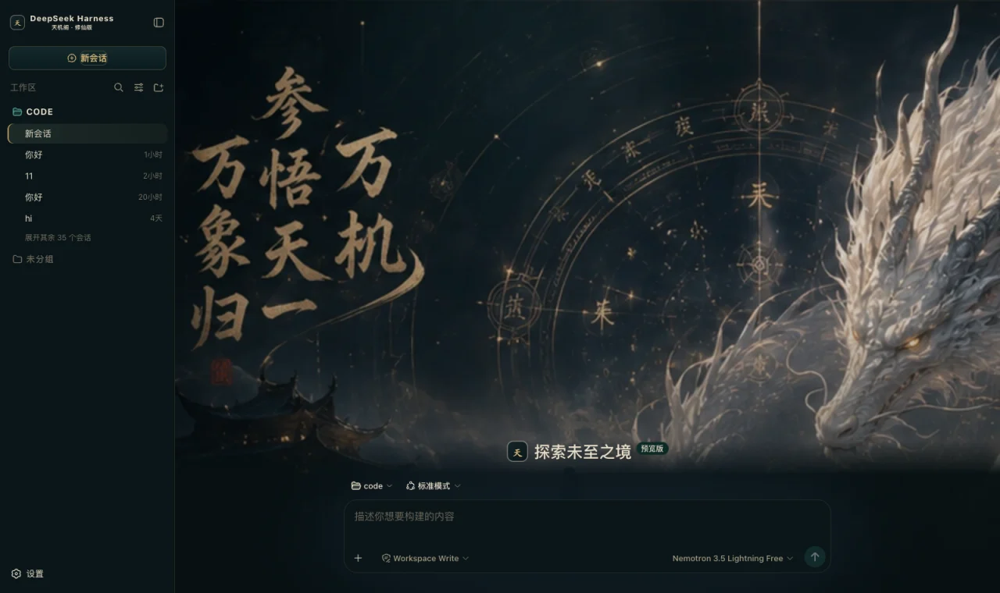

✔ dsh-dark-xianxia/README.md
 · 修仙版

DeepSeek Harness（dsh）的皮肤：墨青黑打底、古金做边与按钮、玉青只给运行中、朱砂只给危险，新会话页是一整幅召请天机主视觉



## What it changes

- **整套语义 token**：底色墨青黑 `#071012`，面板暖灰黑，全场两条带古金的暗描边
  （`rgba(189,151,88,.18)` / `.28`），文字 `#e8dfca`。约 80 个 `--dsw-alias-*` / `--dsw-specific-*`
  一次性换掉，界面的每一层都跟着走。
- **顶部一团灵气**：`body::before` 铺原型那条 `radial-gradient(circle at 50% 0%, rgba(45,92,94,.16), transparent 34%)`，
  让墨黑底不至于死板。`pointer-events: none` 保证不拦点击。
- **新会话页整幅封面**：书法「参悟天机 · 万象归一」、仗剑的道友与那条神龙。进入对话与轨迹页后封面收起。
- **品牌标接管**：侧栏与 hero 的标都换成一枚「天」字金章，副标「天机阁 · 修仙版」。
- **人格化文案**：思考中 → 「道童正在参悟天机……」；失败 → 「天机紊乱，请重新推演。」；
  需要你确认时前缀一句「此事涉及因果，请真人裁决」——**原文照旧留着**，那才是你做判断的依据。
- **A right-hand status dock**: always present; see the table below.

## Palette rules

The prototype's theme rules state the ratio as a single figure, and it is this skin's hardest constraint:

> **70% 墨青黑 / 18% 暖灰黑 / 8% 古金 / 3% 玉青 / 1% 朱砂**

| Colour | Value | Share | Used for |
|---|---|---|---|
| 墨青黑 | `#071012` | 70% | 底 |
| 暖灰黑 | `#0b1619` / `#0f1d21` / `#13252a` | 18% | 面板、输入框、气泡 |
| 古金 | `#c09b5c` / `#e0bd7b` | 8% | 描边、主操作、品牌字。「8%」的意思是**边和按钮**，不是大面积铺 |
| 玉青 | `#4d9b8f` | 3% | 只给**正在跑** |
| 朱砂 | `#bf5a47` | 1% | 只给**危险与失败**。原型全场只有「终止运行」那一处 |

🔴 **成功态也走玉青**：这套稿子的调色盘里根本没有绿，硬塞一个会同时破坏「3% 玉青」和「70% 墨青黑」
两条配比。宁可让成功与运行同色系（用亮度区分 `#74b5a9` / `#4d9b8f`），也不引入第六种颜色。

还有一句同样写死在稿子里：**强世界观视觉集中在 New Session / Empty State，进入工作流后回到克制的
深色开发工具界面，这样才适合真实长期使用**。所以封面只画在 hero，三栏布局与信息密度一处不动。

### What the status dock shows

| Card | Fields | Source |
|---|---|---|
| Waiting on you | Tools awaiting approval, questions awaiting an answer | `ConversationSnapshot.pending`. **Appears only when something is genuinely waiting** |
| Current Session | State, elapsed turn time, current tool duration, inbox, model | `running` / `turnTimings` / `runningCalls` / `queue`; the model comes from the latest assistant message's `provenance.model` |
| Context | Occupancy %, token load, and the System / tool-schema / conversation composition bar | The `contextPressure` and `contextBreakdown` projections |
| Permission | The active permission and sandbox mode | The `permissions` projection |
| Usage | Input / output / cache hits / time spent / turns | The `tokenUsage` and `sessionStats` projections |
| Plan | Todo progress | The `todos` projection (the card is absent when there is no list) |
| Tool calls | Tool name · real duration · outcome | Trajectory `tool-result` nodes (duration = `time - callTime`) plus the snapshot's `runningCalls`. **Appears only once a call has happened** |
| 经卷查阅 | 每条上下文注入的来源与形态 | trajectory 的 `context` 节点（`provenance.label` / `form`） |
| Folded away | Compaction count, items and tokens folded | Trajectory `compaction` nodes. **Absent when nothing was compacted** |

⚠️ **A tool duration may be absent**: it can only be computed while the matching `tool/call` is still inside the session window. Older calls that scrolled past report only name and outcome — better blank than an invented figure.

⚠️ **Composition is not a total**: the three `contextBreakdown` figures use fixed-density estimates (systematically low for Chinese and JSON schema)
and **do not add up** to the token load, which is anchored to the provider's reported value. The UI says so too.

## Deliberately not done

原型右栏「神通调用」那四行——天机推演阵 `已完成 2.1s`、灵脉探测术 `已完成 3.7s`、
经卷查阅·玉清篇 `运行中 8.4s`、阵法模拟·九宫 `等待中`——是稿子里写死的演示数据；
侧栏底部那条「灵力 68,250 / 108,000」和顶栏的「天机未泄，静待道友下令」同理。

**harness 没有对应的投影**。装饰可以，假状态不行：一条永远停在 68,250 的灵力槽，
第二次看见就没人信了，而它旁边那些真数字会跟着一起被怀疑。所以右栏只留能对上真实数据的卡。

原型 Agent copy 里的 `Tool → 正在调用神通……` 与 `Context → 正在翻阅经卷……` 也没做：
The harness's tool rows have only ok / error and no running to hang on, and forcing one would produce a permanently lit fake state.

## Install

**Skin market** (recommended): find it in the market and install, then **restart dsh**.

Manual install (during development):

```bash
npm install && npm run build
DST=~/.dsh/profiles/web/node_modules/dsh-dark-xianxia
mkdir -p "$DST" && cp -R lib cordis.patch.yml skin.json package.json README.md "$DST/"
# 再把 dsh-dark-xianxia 加进 profile 的 package.json 的 dependencies 与 dsh.profile.bundles
```

After changing it you **must restart dsh**: the profile tree has to be recomposed, and without a restart the UI stays as it was.

## 🔴 The side effect of autoApply

Installing switches to this skin by default (`autoApply`, default `true`). The reason is that the harness **does not persist third-party theme ids**,
and the **built-in Settings → Appearance has only three cells: light / dark / follow system**, with no third-party themes —
switching manually requires the skin market's own panel (**Settings → Skin Market**).

The cost: **it reapplies on every refresh**, so switching away lasts only for that session. To change permanently, set `autoApply` to `false`
or uninstall the plugin. It is implemented as an 8-second window after startup (long enough to outlast the Host preference snapshot), after which it lets go entirely.

## Version requirements

Requires **dsh 0.1.1-rc.2 or newer**. The brand-slot takeover relies on slot `priority` shadowing (only equal
priorities count as a conflict; different priorities shadow, and the lower number renders). On older versions these three registrations throw and are swallowed,
**merely falling back to the official brand mark**, while the palette and cover keep working.

## Assets

封面来自原型稿的整屏设计图，裁去了稿子自己的「召请天机」标题与顶栏残边，只留画面（660x475 webp，内联成 data URI）。

## Development

```bash
npm run check   # tsc --noEmit
npm run build   # produces lib/index.js (host half) and lib/client.js (browser half)
```

`lib/` **must be committed**: skins install via `github:owner/repo`, which installs the build output from the repository;
if the source moves and the output does not, people install the old version (and the market uninstalls the package outright over the missing entry file).

## License

MIT © Science Roam Limited
