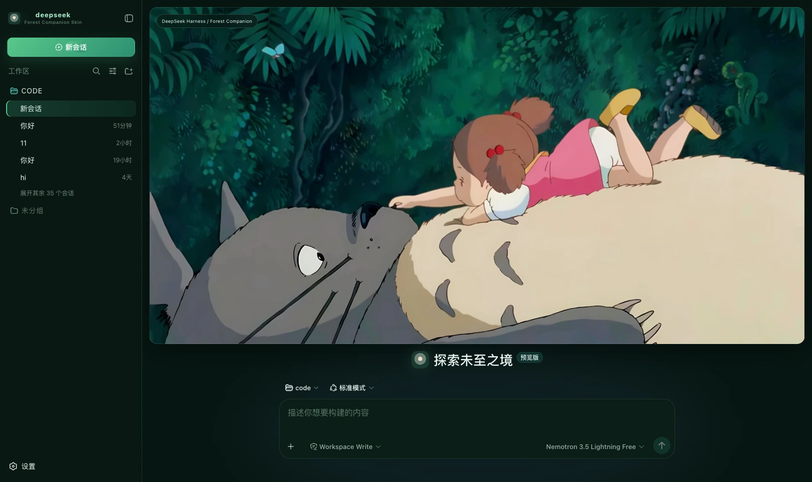

# dsh-forest-companion · Forest Companion

A dark skin for DeepSeek Harness (dsh): deep forest green, soft cream and a touch of pink, with a full-bleed forest companion cover on the new-session page.



## What it changes

| Surface | Content |
|---|---|
| Palette | A full set of `--dsw-alias-*` / `--dsw-specific-*` semantic tokens on the dark base, with every border a 1px line tinted grass green |
| New session | The cover takes all the height above the composer (a 16px radius, a grass-green border, a deep shadow), the composer sits separately below, and an identity badge occupies the top-left corner |
| Brand slots | The sidebar and new-session marks are a pure-CSS **shaft of forest light** (a cream core, a grey-green ring, a deep-forest ground and a green glow), with the subtitle `Forest Companion Skin` |
| 右侧状态台 | 对话页常驻：缩小版封面 + 六类真实状态，可收起（记住选择） |

### The palette is the prototype's own three words

The prototype's notes read "deep forest green, soft cream and **a touch of pink echoing the character**", and the
handoff says `theme = deep green / soft cream / warm pink`. Three words, three uses:

- **Deep forest green**: ground, panels, borders and the primary action — most of the interface;
- **Soft cream `#e9e0c5`**: only at the end of the energy bar and in the brand mark's core, like light through the canopy;
- **A touch of pink `#d96f95`**: the prototype uses it in two places only, both very faint — a **5%** glow on the cover
  and the current-mode card's border. **"A touch" is its definition**; spread wider it no longer echoes the figure in the picture.
  Here it lands on the cover glow (copying that 5%) and on hovering a destructive action, and the error colour leans
  pink too (`#e07f9f`) — the prototype gives no error colour, and pink is its only warm-against-cool contrast, which keeps
  nothing glaring while introducing no fifth colour out of thin air.

Running uses teal `#4db9b0`, a step apart from the success green — running and success should never read as one.

### The layout follows the prototype

The prototype states the rule itself: New Session **keeps the whole cover** with the **composer separately below**,
while the left and right columns keep Harness's full session, system, mode and status information. Its `#home` is
likewise `column` plus `.hero { flex: 1 }` with a separate `.composer` below. So the cover does not sit over the composer, and carries no copy beyond the badge in its top-left corner.

### What the status dock shows

| Card | Fields | Source |
|---|---|---|
| Waiting on you | Tools awaiting approval, questions awaiting an answer | `ConversationSnapshot.pending`. **Appears only when something is genuinely waiting** |
| Current Session | State, elapsed turn time, current tool duration, inbox, model | `running` / `turnTimings` / `runningCalls` / `queue`; the model comes from the latest assistant message's `provenance.model` |
| Context | Occupancy %, token load, and the System / tool-schema / conversation composition bar | The `contextPressure` and `contextBreakdown` projections |
| Permission | The active permission and sandbox mode | The `permissions` projection |
| Usage | Input / output / cache hits / time spent / turns | The `tokenUsage` and `sessionStats` projections |
| Plan | Todo progress | The `todos` projection (the card is absent when there is no list) |
| Forest tracks | Tool name · real duration · outcome | Trajectory `tool-result` nodes (duration = `time - callTime`) plus the snapshot's `runningCalls`. **Appears only once a call has happened** |
| Context injections | The source and form of each injection | Trajectory `context` nodes (`provenance.label` / `form`) |
| Folded away | Compaction count, items and tokens folded | Trajectory `compaction` nodes. **Absent when nothing was compacted** |

⚠️ **A tool duration may be absent**: it can only be computed while the matching `tool/call` is still inside the session window. Older calls that scrolled past report only name and outcome — better blank than an invented figure.

⚠️ **Composition is not a total**: the three `contextBreakdown` figures are fixed-density estimates and **do not add up** to the token load.

## Four things deliberately not done

These are all **hardcoded decoration** in the prototype with no matching projection in the harness, so none are built — decoration is fine; fake state is not:

- the five `ONLINE` rows under Harness Systems in the right column
- the four Companion Modes cards in the right column
- the 83% and 100% under Forest Energy in the right column
- the "☘ GROVE ONLINE" badge in the cover's top-right corner

**No host copy is replaced either**: this prototype gives no agent-copy specification, and inventing lines without a basis is embellishment.

## Install

**Skin market** (recommended): search for "Forest", install, then **restart dsh**.

Manual install (during development):

```bash
npm install && npm run build
DST=~/.dsh/profiles/web/node_modules/dsh-forest-companion
mkdir -p "$DST" && cp -R lib cordis.patch.yml skin.json package.json README.md "$DST/"
# then add dsh-forest-companion to the profile package.json's dependencies and dsh.profile.bundles
```

## 🔴 The side effect of autoApply

Installing switches to this skin by default. The harness **does not persist third-party theme ids**, and the built-in Settings → Appearance offers only
three cells — light / dark / follow system — so switching manually requires the skin market's own panel. The cost is that it reapplies on every refresh:
switching away lasts only for that session. To change permanently, set `autoApply` to `false` or uninstall.

## Version requirements

Requires **dsh 0.1.1-rc.2 or newer** (the brand-slot takeover relies on slot `priority` shadowing; older versions simply fall back to
官方品牌标，配色与横幅照常）。

## Assets

The cover is a 2048×1110 illustration compressed to webp (q92, 140 KB) and inlined into the bundle rather than linked from an image host.
How it is generated and its resolution ceiling are documented at the top of `src/client/cover.generated.ts`.

## Development

```bash
npm run check   # tsc --noEmit
npm run build   # produces lib/index.js (host half) and lib/client.js (browser half)
```

`lib/` must be committed: skins install via `github:owner/repo`, which installs the build output from the repository.

## License

MIT © Science Roam Limited
