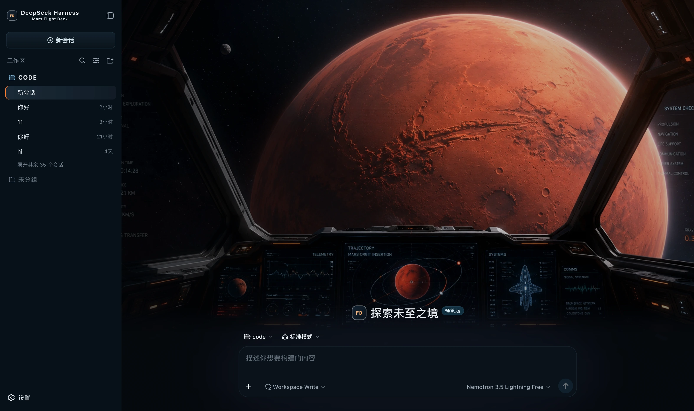

✔ dsh-mars-flight-deck/README.md
驶舱

DeepSeek Harness（dsh）的皮肤：航天黑打底、冷蓝做遥测与描边、推进器橙做主操作、Nominal 绿只给成功，新会话页是一整幅驾驶舱主视觉



## 它改了什么

- **整套语义 token**：底色航天黑 `#05080d`，三级面板往上是深蓝控制台，全场两条描边——
  冷蓝的 `rgba(142,181,203,.12)`（仪表盘细线）与橙的 `rgba(255,122,46,.14)`（强调框），
  文字 `#e8edf2`。约 80 个 `--dsw-alias-*` / `--dsw-specific-*` 一次性换掉。
- **舱内光**：`body::before` 铺原型那两条 radial——顶部一团冷蓝、右上一团推进器橙，
  让死黑的底像坐在亮着仪表的舱里。`pointer-events: none` 保证不拦点击。
- **新会话页整幅封面**：舷窗、近距离的火星与整排仪表。进入对话与轨迹页后封面收起。
- **品牌标接管**：侧栏与 hero 的标都换成一枚 `FD`（Flight Deck）方标，副标「Mars Flight Deck」。
- **人格化文案**：思考中 → `Computing trajectory…`；失败 → `Mission anomaly detected.`；
  需要你确认时前缀一句 `Command authorization required`——**原文照旧留着**，那才是你做判断的依据。
- **右侧状态台**：常驻一根，见下表。

## 配色规则

原型稿的 Theme rules 把配比写成了一句数字，这是这套皮肤最硬的约束：

> **80% 航天黑与深蓝控制面板，10% 冷蓝遥测信息，6% 推进器橙色交互强调，
> 3% Nominal 绿色状态，1% 红色异常态**

| 色 | 值 | 占比 | 用在哪 |
|---|---|---|---|
| 航天黑 / 深蓝面板 | `#05080d` → `#142331` | 80% | 底与三级面板 |
| 冷蓝遥测 | `#7fb4d3` | 10% | 描边、次要数据、**正在跑** |
| 推进器橙 | `#ff7a2e` | 6% | **交互强调**：主操作、选中项 |
| Nominal 绿 | `#73b89a` | 3% | 只给**一切正常**（成功态） |
| 红 | `#d9503f` | 1% | 只给**异常** |

🔴 **橙和绿的分工不能串**：橙是「你要做的事」，绿是「已经好了」。
驾驶舱里把这两个搞混，代价是看一眼仪表分不清该不该动手。所以主操作、hover、选中一律走橙，
成功态一律走绿，两边一处都不借用对方。

🔴 **冷蓝不做实心按钮**：它在这套里是「遥测与描边」的语言，铺成大块会把仪表盘的层次压平。

还有一句同样写死在稿子里：**New Mission 使用强驾驶舱场景，Console / Flight Path 回归低干扰工程界面**。
所以封面只画在 hero，三栏布局与信息密度一处不动。

### 右侧状态台显示什么

| 卡片 | 字段 | 来源 |
|---|---|---|
| 等你拿主意 | 待授权的工具名、待回答的问题数 | `ConversationSnapshot.pending`。**只在真有东西等你时出现** |
| Current Session | 状态、本轮已跑、当前工具耗时、收件箱、模型 | `running` / `turnTimings` / `runningCalls` / `queue`；模型取最近一条助手消息的 `provenance.model` |
| Context | 占用 % + Token 负载 + System / 工具 schema / 对话 构成条 | `contextPressure` + `contextBreakdown` 投影 |
| Permission | 当前权限·沙箱模式 | `permissions` 投影 |
| Usage | 输入 / 输出 / 缓存命中 / 耗时 / 轮次 | `tokenUsage` + `sessionStats` 投影 |
| Plan | 待办进度 | `todos` 投影（没有清单时整张卡不出现） |
| SYSTEM OPS | 工具名 · 真实耗时 · 成败 | trajectory 的 `tool-result` 节点（耗时 = `time - callTime`）＋快照的 `runningCalls`。**只在有过调用时出现** |
| CONTEXT UPLINK | 每条上下文注入的来源与形态 | trajectory 的 `context` 节点（`provenance.label` / `form`） |
| COMPACTED | 压缩次数、折叠条目数与 token | trajectory 的 `compaction` 节点。**没压缩过就不出现** |

⚠️ **工具耗时可能缺席**：只有配对的 `tool/call` 还在会话窗口内时才算得出来。窗口滚过去的老调用只报名字与成败——宁可空着，也不编一个好看的秒数。

⚠️ **构成不是总量**：`contextBreakdown` 三项用固定密度估算（对中文与 JSON schema 系统性低估），
加起来**不等于** Token 负载（那个锚在供应商上报值）。界面上也写了这句。

## 刻意没做的

原型右栏「Systems」那五行 `PROP / NAV / LSS / COM / PWR — ONLINE`、「Telemetry」里的
`54,621 KM` / `2.56 KM/S` / `0.38 G`、那张静态快捷键表，以及侧栏底部的「Compute Load 71%」
和封面右上角的「ALL SYSTEMS NOMINAL」，**harness 都没有对应的投影**。

装饰可以，假状态不行。这套皮肤尤其如此：一块永远显示 NOMINAL 的系统面板，
在"驾驶舱"这个语境下正好是最误导人的东西——它旁边那些**真**数字会跟着一起被怀疑。
所以右栏只留能对上真实数据的卡。

hero 上那四颗任务预设（`Analyze orbital trajectory` / `Inspect system anomaly`…）也没做：
它们在稿子里是写死的文案，而 harness 的建议来自会话上下文，硬编一组只会给出永远一样的四句话。

## 安装

**皮肤集市**（推荐）：在集市里搜到它并安装，装完**重启 dsh**。

手工装（开发期）：

```bash
npm install && npm run build
DST=~/.dsh/profiles/web/node_modules/dsh-mars-flight-deck
mkdir -p "$DST" && cp -R lib cordis.patch.yml skin.json package.json README.md "$DST/"
# 再把 dsh-mars-flight-deck 加进 profile 的 package.json 的 dependencies 与 dsh.profile.bundles
```

改完**必须重启 dsh**：profile 树要重新组装，不重启界面还是旧的。

## 🔴 autoApply 的副作用

装上默认就切到本皮肤（`autoApply`，默认 `true`）。原因是 harness **不持久化第三方主题 id**，
而且**内置的「设置 → 外观」只有 浅色 / 深色 / 跟随系统 三个格子**，第三方主题不在那里——
要手动切换得用皮肤集市自己的面板（**设置 → 皮肤市场**）。

代价：**每次刷新都会重新应用**，你切走只对当次有效。想永久换走把 `autoApply` 设成 `false`，
或者卸载本插件。实现上是启动后 8 秒的窗口（要盖过 Host 偏好快照的覆盖），窗口一过彻底松手。

## 版本要求

需要 **dsh 0.1.1-rc.2 或更新**。品牌位的接管依赖 slot 的 `priority` 影子化（同一 priority 才算
占用冲突，不同 priority 是影子化、数字小的渲染）；更老的版本上这三处注册会抛错并被吞掉，
**只是退回官方品牌标**，配色与封面照常工作。

## 素材

封面是原型稿里那张干净插画（1536x1024），按 hero 的宽高比裁成 1423x1024，cwebp q95 原生分辨率——仪表细线与火星表面的陨石坑纹理经不起缩图。

## 开发

```bash
npm run check   # tsc --noEmit
npm run build   # 产出 lib/index.js（host 半）与 lib/client.js（浏览器半）
```

`lib/` **要提交进仓库**：皮肤靠 `github:owner/repo` 安装，装的是仓库里的构建产物；
源码更新了产物没更新，别人装到的还是旧版（集市还会因为入口文件缺失直接把包卸回去）。

## License

MIT © Science Roam Limited
