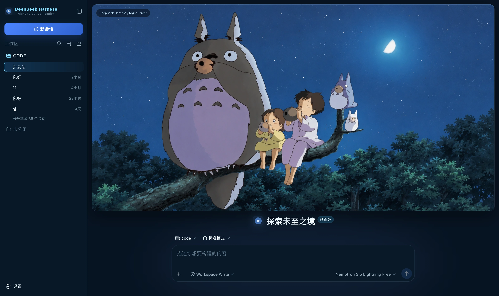

✔ dsh-night-forest-companion/README.md
伴

DeepSeek Harness（dsh）的皮肤：月夜蓝打底、月光青做描边与状态、主操作走蓝，新会话页是一整幅夜林横幅



## What it changes

- **整套语义 token**：底色月夜蓝 `#071423`，面板森林深色 `#0b1c2e`，全场一条带月光青的暗描边
  `rgba(150,205,255,.16)`，文字 `#eef8ff`。约 80 个 `--dsw-alias-*` / `--dsw-specific-*`
  一次性换掉，界面的每一层都跟着走。
- **新会话页整张横幅**：树枝上的一大两小、夜空与那弯月，16px 圆角配月光青描边和很深的投影；
  输入区独立放在下方，两者不重叠；封面左上角留一枚身份角标。进入对话与轨迹页后横幅收起。
- **品牌标接管**：侧栏与 hero 的标都换成一枚月环标，副标「Night Forest Companion」。
- **A right-hand status dock**: always present; see the table below.

## Palette rules

原型稿自己在对话里把规则写清楚了：

> 已将主题整体收束到**月夜蓝、森林深色与柔和冷光**。

handoff 里写得更直接：`theme = night blue / moon cyan / soft glow`、`mode = calm companion`。

| 色 | 值 | 用在哪 |
|---|---|---|
| 月夜蓝 / 森林深色 | `#071423` / `#0b1c2e` | 底与面板——绝大部分界面 |
| 月光青 | `#7bdcff` | 描边、强调、**正在跑**。画里那圈月光 |
| 蓝 | `#467fff` | 主操作。原型 `.new` 的 `linear-gradient(135deg,#4b84ff,#2f62ce)` |

🔴 **月光青不做实心按钮**：它在这套里是「描边与状态」的语言，铺成大块会把夜的安静打破。
主操作因此走蓝。

🔴 **这套皮肤一个暖色都没有，是有意的**：`calm companion` 的意思就是不要有任何东西跳出来喊你。
原型只画了正常流程、没给警告与错误色，所以警告压在低饱和的柔黄（`#dcc98a`）、
错误压在低饱和的粉红（`#e0808f`）上——**绝不用橙红**。

### What the status dock shows

| Card | Fields | Source |
|---|---|---|
| Waiting on you | Tools awaiting approval, questions awaiting an answer | `ConversationSnapshot.pending`. **Appears only when something is genuinely waiting** |
| Current Session | State, elapsed turn time, current tool duration, inbox, model | `running` / `turnTimings` / `runningCalls` / `queue`; the model comes from the latest assistant message's `provenance.model` |
| Context | Occupancy %, token load, and the System / tool-schema / conversation composition bar | The `contextPressure` and `contextBreakdown` projections |
| Permission | The active permission and sandbox mode | The `permissions` projection |
| Usage | Input / output / cache hits / time spent / turns | The `tokenUsage` and `sessionStats` projections |
| Plan | Todo progress | The `todos` projection (the card is absent when there is no list) |
| 夜行记录 | 工具名 · 真实耗时 · 成败 | trajectory 的 `tool-result` 节点（耗时 = `time - callTime`）＋快照的 `runningCalls`。**只在有过调用时出现** |
| Context injections | The source and form of each injection | Trajectory `context` nodes (`provenance.label` / `form`) |
| Folded away | Compaction count, items and tokens folded | Trajectory `compaction` nodes. **Absent when nothing was compacted** |

⚠️ **A tool duration may be absent**: it can only be computed while the matching `tool/call` is still inside the session window. Older calls that scrolled past report only name and outcome — better blank than an invented figure.

⚠️ **Composition is not a total**: the three `contextBreakdown` figures use fixed-density estimates (systematically low for Chinese and JSON schema)
and **do not add up** to the token load, which is anchored to the provider's reported value. The UI says so too.

## Deliberately not done

原型右栏的「Harness Systems」五行 `AI / MM / CX / VS / FS — ONLINE`、
「Companion Modes」四张模式卡（Calm / Wonder / Focus / Memory）、
「Moonlight Energy」那个 `Energy Level 82% · Night Sync 100%`，
以及封面右上角的「☾ MOONLIGHT READY」，**harness 都没有对应的投影**。

装饰可以，假状态不行：一个永远停在 82% 的能量值，第二次看见就没人信了，
而它旁边那些真数字会跟着一起被怀疑。所以右栏只留能对上真实数据的卡。

**这套稿子也没给 Agent copy 规范**，所以宿主文案一句都不替换。
没有依据的人格化文案是自己加戏。

## Install

**Skin market** (recommended): find it in the market and install, then **restart dsh**.

Manual install (during development):

```bash
npm install && npm run build
DST=~/.dsh/profiles/web/node_modules/dsh-night-forest-companion
mkdir -p "$DST" && cp -R lib cordis.patch.yml skin.json package.json README.md "$DST/"
# 再把 dsh-night-forest-companion 加进 profile 的 package.json 的 dependencies 与 dsh.profile.bundles
```

After changing it you **must restart dsh**: the profile tree has to be recomposed, and without a restart the UI stays as it was.

## 🔴 The side effect of autoApply

Installing switches to this skin by default (`autoApply`, default `true`). The reason is that the harness **does not persist third-party theme ids**,
and the **built-in Settings → Appearance has only three cells: light / dark / follow system**, with no third-party themes —
switching manually requires the skin market's own panel (**Settings → Skin Market**).

The cost: **it reapplies on every refresh**, so switching away lasts only for that session. To change permanently, set `autoApply` to `false`
or uninstall the plugin. It is implemented as an 8-second window after startup (long enough to outlast the Host preference snapshot), after which it lets go entirely.

## Version requirements

Requires **dsh 0.1.1-rc.2 or newer**. The brand-slot takeover relies on slot `priority` shadowing (only equal
priorities count as a conflict; different priorities shadow, and the lower number renders). On older versions these three registrations throw and are swallowed,
**merely falling back to the official brand mark**, while the palette and cover keep working.

## Assets

封面是原型稿里那张干净插画（1672x941），一刀不裁，cwebp q95 原生分辨率——大面积平涂的夜空最吃编码质量，压一档就在蓝色渐变上起色带。

## Development

```bash
npm run check   # tsc --noEmit
npm run build   # produces lib/index.js (host half) and lib/client.js (browser half)
```

`lib/` **must be committed**: skins install via `github:owner/repo`, which installs the build output from the repository;
if the source moves and the output does not, people install the old version (and the market uninstalls the package outright over the missing entry file).

## License

MIT © Science Roam Limited
