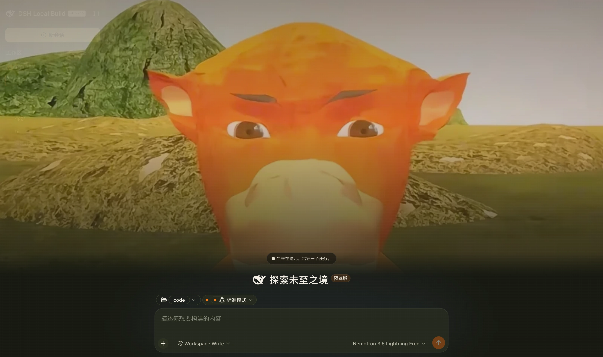

# dsh-niulai · Niulai Field

A dark skin for [DeepSeek Harness](https://github.com/deepseek-ai/deepseek-harness): a field at dusk, with a low-poly orange cow standing beneath your conversation.



The ground is a warm black with a grass-green cast, `#171911` — not neutral grey, which is the most visible difference from the built-in dark theme, whose family leans blue. The primary button becomes the cow's body orange `#ff7a14`, and dividers and scrollbars run from grass to straw. **Dark only.**

## Install

**Not published to npm**; install from GitHub:

```sh
dsh plugin --profile web add -w github:keman-ai/dsh-niulai
```

**`-w` is not optional.** The profile directory ships a `pnpm-workspace.yaml`, so pnpm reads it as a workspace root and without the flag fails outright with `ERR_PNPM_ADDING_TO_ROOT`.

Restart dsh once and it **takes effect on install**.

To return to "install only registers it; select it yourself", turn auto-apply off in the profile's `cordis.patch.yml`:

```yaml
- id: niulai
  config:
    autoApply: false
```

Why auto-apply is the default: the harness's third-party theme ids **never enter the built-in settings schema** (see the ui-theme README), so the choice lives only in the process and is never written to `$DSH_HOME/settings.yaml`. Without auto-apply you would return to Settings → Appearance and reselect on every start — installing a skin and not seeing it. You may switch away at any time; the plugin switches once at load and never takes the choice back.

The repository ships its build output (`lib/`) and has no `prepare` script, so pnpm runs no build script when installing from a git source and you never have to grant `allowBuilds`.

### Uninstall

```sh
dsh plugin --profile web remove -w dsh-niulai
```

Unregistering the theme resets the preference to the default, so the UI never sticks on a palette that no longer exists.

## What it changes

| Layer | Content | Does a redesign break it? |
|---|---|---|
| **Palette** | About 80 `--dsw-alias-*` / `--dsw-specific-*` semantic tokens | No. Tokens are a semantic contract, and a harness redesign does not change their meaning |
| **Background** | A translucent cow spread at the lowest layer, darkened by gradients above and below | No. It hangs only on our own `body[data-dsh-niulai]` |

**Deliberately not done**: hooking individual parts (putting a cow avatar beside assistant messages, rebranding the title bar). That needs fuzzy `[class*='sidebarCol']` matches against the harness's internal hashed CSS module names — more striking, but it shatters the moment the host is redesigned. Niulai bets on the semantic layer instead, buying upgrades that do not break.

The background **appears only while the Niulai theme is active**: switching back to the built-in dark removes the element and the body attribute. A cow still spread while the palette is no longer the field's is pure visual pollution.

## Palette at a glance

The draft's 25 variables are the whole colour source, held in `NIULAI_PALETTE` in `src/client/tokens.ts`. Recolour there.

| | |
|---|---|
| Primary orange / deep orange | `#ff7a14` / `#e95e0a` |
| Muzzle cream | `#f0d28a` |
| Grass / moss / straw | `#737746` / `#4f5f32` / `#b49a54` |
| Ground / sidebar / three container levels | `#171911` / `#1c1f16` / `#20231a` `#25291e` `#2b3022` |
| Body / secondary / tertiary text | `#f3efe4` / `#b7b6a5` / `#858777` |
| Success / warning / danger / info | `#91b65b` / `#d9b45e` / `#db735b` / `#7f9fbf` |

The mapping is semantic alignment, not colour-by-colour transcription: the draft's `--surface/-2/-3` are three container levels and so are the harness's `bg-layer-1/2/3`. What the draft omits (scrims, skeletons, toolbar buttons) is derived from the existing ramp, with the rule stated in each section of `tokens.ts`.

## Development

```sh
pnpm install
pnpm check     # type check
pnpm build     # → lib/index.js (host half) + lib/client.js (browser half)
```

| File | Responsibility |
|---|---|
| `src/index.ts` | The host half, the Loader's mount point |
| `src/client/index.ts` | Registers the theme and mounts the background layer, both through `ctx.effect` for full cleanup |
| `src/client/tokens.ts` | The mapping from 25 design variables to 80 semantic tokens |
| `src/client/niulai.module.css` | Background-layer styles |
| `src/client/cow-art.generated.ts` | The inlined cow artwork (generated from the source with `cwebp`; nothing hand-written) |

**`lib/` is committed on purpose**: this package is not published to npm and everyone installs from a git source, so shipping the output avoids betting on the other machine's toolchain. Commit the `pnpm build` output along with your code changes.

Both cow images are generated from the draft's 1011×702 original:

```sh
cwebp -crop 300 55 470 470 -resize 256 256 -q 84 source.png -o cow-avatar.webp   # 6KB
cwebp -q 76 source.png -o cow-cover.webp                                          # 32KB
```

`types/dsh.d.ts` vendors the parts of the harness API we use, transcribed from `0.1.0-rc.7` — the `@deepseek-ai/dsh-client-*` dependency chain on npm is incomplete and cannot be installed. When host behaviour disagrees with the declarations, check that file first.

## Related

- [dsh.a2hmarket.ai](https://dsh.a2hmarket.ai) — the DSH skin market
- [dsh-skin-market](https://github.com/keman-ai/dsh-skin-market) — browse the market and install skins in one click from dsh's settings

## License

[MIT](LICENSE) © 2026 Science Roam Limited
