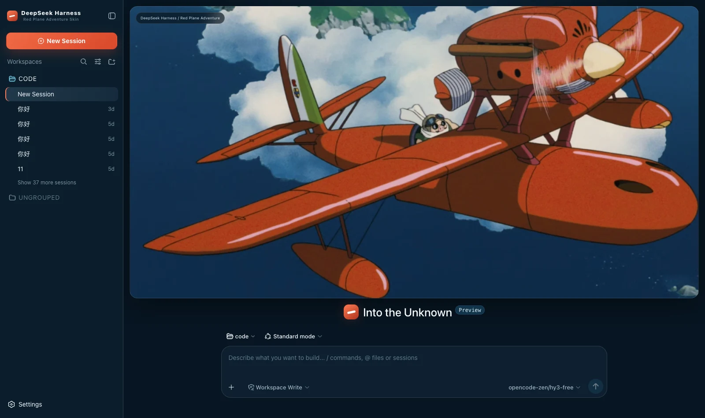

# dsh-red-plane-adventure · Red Plane Adventure

A dark skin for DeepSeek Harness (dsh): deep navy as the ground, flight red for the primary action, cream as accent alone and cyan only for running, with a full red-plane banner on the new-session page.



## What it changes

| Surface | Content |
|---|---|
| Palette | A full set of `--dsw-alias-*` / `--dsw-specific-*` semantic tokens on the dark base, with every border the one neutral white line the prototype uses |
| Global | One cool wash high on the right (`radial-gradient(circle at 60% -12%, rgba(46,122,165,.18), transparent 34%)`), so the navy reads as sky rather than as a dark panel |
| New session | The banner takes all the height above the composer (an 18px radius, a neutral border, a deep shadow), the composer sits separately below, and an identity badge occupies the top-left corner |
| Brand slots | The sidebar and new-session marks are a pure-CSS square in the aircraft's red, crossed by one white wing bar rotated -12°, with the subtitle `Red Plane Adventure Skin` |
| Status dock | Always present on the chat page: a reduced banner plus six kinds of real state, collapsible (the choice is remembered) |

## The palette is four words from the prototype

The prototype writes it into its own trajectory panel:

> `theme = deep navy / flight red / cream / cyan`

| Colour | Value | Used for |
|---|---|---|
| Deep navy | `#071522` → `#132b3e` | Ground and panels — most of the interface, and the sky the plane flies in |
| Flight red | `#e6502e` / `#ff7b52` | The primary action and emphasis |
| Cream | `#ffd0bd` / `#ffb079` | Small warm accents only: session icons, badge text, the middle of the energy gradient |
| Cyan | `#72cce8` | The only cool accent, and therefore **running** |

🔴 **The large button here really is solid red**, unlike this pack's quieter skins. The prototype paints `.new` and
`.send` with the same `linear-gradient(135deg,#f16a45,#d9482b)` — the aircraft is the loudest thing in the picture,
and the primary action is meant to be the loudest thing in the interface. Cream is never a button surface: it is
light on the clouds, and a solid fill of it would put the warmth everywhere and leave the aircraft nothing to be.

🔴 **Green is not in those four words, but it earns its place.** The prototype uses `#69d49b` for exactly one thing —
`● SKY READY`, the five `ONLINE` rows, the `✓ ready` on a tool head. So green means **done / online** and cyan means
**in progress**. Keeping them apart is what lets you tell at a glance whether a run landed or is still flying.

🔴 **Error had to move.** The prototype gives no error colour and red is already spent on the primary action, so
error sits one step **redder** than the orange-leaning action red (`#f0625f`) — separated by hue and luminance
rather than by importing a fifth colour the design never asked for. Warning takes the cream's apricot end, which is
likewise already on the palette.

🔴 **Borders carry no tint.** The prototype uses exactly one, `rgba(255,255,255,.12)`. The cover is already the
loudest thing here; a tinted border would compete with it instead of framing it.

### What the status dock shows

| Card | Fields | Source |
|---|---|---|
| Waiting on you | Tools awaiting approval, questions awaiting an answer | `ConversationSnapshot.pending`. **Appears only when something is genuinely waiting** |
| Current Session | State, elapsed turn time, current tool duration, inbox, model | `running` / `turnTimings` / `runningCalls` / `queue`; the model comes from the latest assistant message's `provenance.model` |
| Context | Occupancy %, token load, and the System / tool-schema / conversation composition bar | The `contextPressure` and `contextBreakdown` projections |
| Permission | The active permission and sandbox mode | The `permissions` projection |
| Usage | Input / output / cache hits / time spent / turns | The `tokenUsage` and `sessionStats` projections |
| Plan | Todo progress | The `todos` projection (the card is absent when there is no list) |
| Flight log | Tool name · real duration · outcome | Trajectory `tool-result` nodes (duration = `time - callTime`) plus the snapshot's `runningCalls`. **Appears only once a call has happened** |
| Context injections | The source and form of each injection | Trajectory `context` nodes (`provenance.label` / `form`) |
| Folded away | Compaction count, items and tokens folded | Trajectory `compaction` nodes. **Absent when nothing was compacted** |

⚠️ **A tool duration may be absent**: it can only be computed while the matching `tool/call` is still inside the session window. Older calls that scrolled past report only name and outcome — better blank than an invented figure.

⚠️ **Composition is not a total**: the three `contextBreakdown` figures are fixed-density estimates and **do not add up** to the token load.

## Four things deliberately not done

These are all **hardcoded decoration** in the prototype with no matching projection in the harness, so none are built — decoration is fine; fake state is not:

- the five `ONLINE` / `SYNCED` rows under Harness Systems in the right column
- the four Flight Modes cards (Adventure / Focus / Explore / Memory)
- the `Energy Level 90%` and `Route Sync 100%` under Flight Energy
- the "✈ ADVENTURE MODE" badge in the cover's top-right corner

The right column's `Current Session` numbers (`00:11:46`, `76,320 tokens`, `836ms`) are hardcoded too — those the dock does show, but from the real projections rather than from the draft.

**No host copy is replaced either**: this prototype gives no agent-copy specification, and inventing lines without a basis is embellishment.

## One implementation detail

The dock's thumbnail crops **centred**, where most sibling skins crop `left center`. The aircraft spans the entire
frame — the propeller runs off the right edge and the lower wing off the left — so any horizontal crop clips a
wingtip or the nose. At 1.92:1 against the dock's 2.4:1 strip, `cover` scales by width and trims only top and
bottom, which is the whole reason a centred crop is safe here.

## Install

**Skin market** (recommended): search for "Red Plane", install, then **restart dsh**.

Manual install (during development):

```bash
npm install && npm run build
DST=~/.dsh/profiles/web/node_modules/dsh-red-plane-adventure
mkdir -p "$DST" && cp -R lib cordis.patch.yml skin.json package.json README.md "$DST/"
# then add dsh-red-plane-adventure to the profile package.json's dependencies and dsh.profile.bundles
```

## 🔴 The side effect of autoApply

Installing switches to this skin by default. The harness **does not persist third-party theme ids**, and the built-in Settings → Appearance offers only
three cells — light / dark / follow system — so switching manually requires the skin market's own panel. The cost is that it reapplies on every refresh:
switching away lasts only for that session. To change permanently, set `autoApply` to `false` or uninstall.

## Version requirements

Requires **dsh 0.1.1-rc.2 or newer** (the brand-slot takeover relies on slot `priority` shadowing; older versions simply fall back to
the official brand mark, with the palette and banner working as usual).

## Assets

The banner is the 1080×563 illustration embedded in the prototype, encoded to webp at q95 in its native resolution
(99 KB) and inlined into the bundle rather than linked from an image host. It is **not** downscaled: the source is
already small enough to upscale about 1.2× filling the hero, and cel-shaded flats with hard outlines are the worst
case for a low-quality encoder. The crop reasoning and resolution ceiling are documented at the top of
`src/cover.generated.ts`.

## Development

```bash
npm run check   # tsc --noEmit
npm run build   # produces lib/index.js (host half) and lib/client.js (browser half)
```

`lib/` is built by CI and packed into the Release tarball; it is not committed in this monorepo.

## License

MIT © Science Roam Limited
