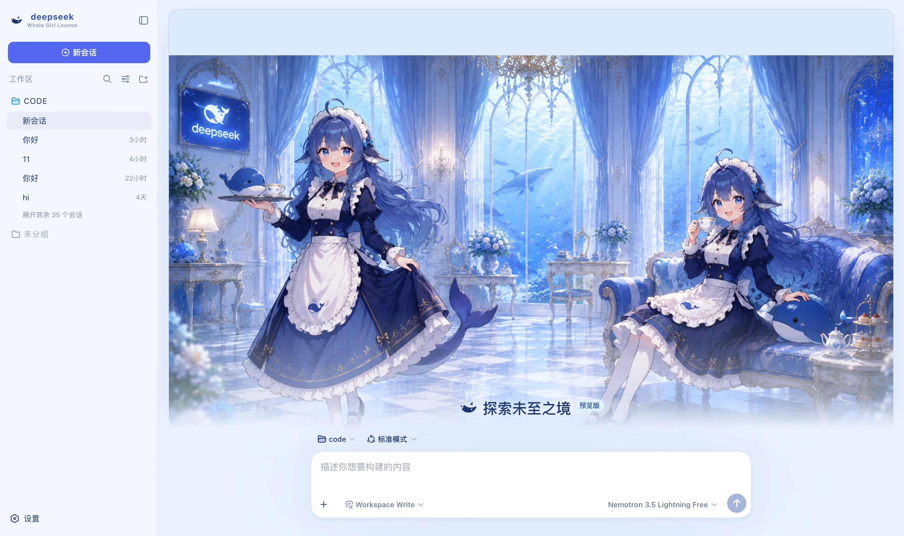

# dsh-whale-girl · 鲸鱼娘海岸休息室

DeepSeek Harness（dsh）的浅色皮肤：浅蓝 / 珍珠白 / 深海蓝三级配色，新会话页是一整幅鲸鱼娘封面。



## 它改了什么

| 面 | 内容 |
|---|---|
| 配色 | 一整套 `--dsw-alias-*` / `--dsw-specific-*` 语义 token（浅色基座）。主操作是 DeepSeek Blue，**绿色保留给在线 / 成功态**，琥珀留给需要确认的操作 |
| 新会话页 | 整幅鲸鱼娘封面 + 输入框贴底。**主视觉只出现在空屏**——进入对话与轨迹页就收起，回到真实工作态 |
| 品牌位 | 侧栏与新会话页的标换成鲸鱼轮廓，站名副标 `Whale Girl Lounge` |
| 右侧状态台 | 对话页常驻：缩小版封面 + 会话状态 / 用量 / 计划三张卡，可收起（记住选择） |
| 组件语言 | 8–12px 圆角、1px 低对比描边、几乎不用阴影 |

### 右侧状态台显示什么

| 卡片 | 字段 | 来源 |
|---|---|---|
| 等你拿主意 | 待授权的工具名、待回答的问题数 | `ConversationSnapshot.pending`（`approval` / `question`）。**只在真有东西等你时出现**，琥珀卡 |
| Current Session | 状态（就绪 / 正在忙） | `ConversationSnapshot.running` |
| | 本轮已跑多久、当前工具跑了多久 | `turnTimings` 里未结束那轮的 `startTime`、`runningCalls[].time`，逐秒走 |
| | 收件箱（排队 / 插话消息数） | `queue` 的 `placement` |
| | 模型 | 最近一条助手消息的 `provenance.model`（Trajectory 视图节点） |
| Context | 占用 % + 进度条、Token 负载 | `contextPressure` 的 `projectedTokens` / `contextWindow` |
| | 构成堆叠条：System / 工具 schema / 对话 | `contextBreakdown` 投影 |
| Permission | 当前权限·沙箱模式 + 说明 | `permissions` 投影（由 `permission/preset`、`sandbox/mode`、`approval/policy` 折出） |
| Usage | 输入 / 输出 / 缓存命中 / LLM 与工具耗时 / 轮次·步数 | `tokenUsage` + `sessionStats` 投影 |
| Plan | 待办完成数与当前那条 | `todos` 投影（没有清单时整张卡不出现） |

⚠️ **构成不是总量**：`contextBreakdown` 的三项用固定密度估算（对中文与 JSON schema 系统性低估），
加起来**不等于**上面的 Token 负载（那个锚在供应商上报值）。界面上也写了这句，别把两者相加。

数字与输入框下方那行官方统计**同源同口径**（上下文用 `projectedTokens`，压缩后会立刻回落；
输入是三个不重叠的计费桶相加；耗时是 `llmMs + toolMs` 而不是墙钟）。

**没做的**：原型稿右栏那五个「Assistant Systems 在线」是纯装饰，harness 没有对应的心跳投影，
不伪造。状态台也**没有**接管 harness 自己的右侧详情栏——那根装的是「点某次工具调用看
Input / Output」，是排障唯一的线索；本皮肤开的是自己的一根，两者并存。

新会话页（hero）与会话回放中（settling）状态台自动收起：那时既没有状态可看，
封面主视觉也不该被切碎。窗口窄于 1180px 时同样收起。

## 安装

**皮肤集市**（推荐）：在 dsh 的皮肤集市里搜「鲸鱼娘」安装，装完**重启 dsh**。

手工装（开发期）：

```bash
npm install && npm run build
DST=~/.dsh/profiles/web/node_modules/dsh-whale-girl
mkdir -p "$DST" && cp -R lib cordis.patch.yml skin.json package.json README.md "$DST/"
# 再把 dsh-whale-girl 加进 ~/.dsh/profiles/web/package.json 的 dependencies 与 dsh.profile.bundles
```

改完**必须重启 dsh**：profile 树要重新组装，不重启界面还是旧的。

## 🔴 autoApply 的副作用

装上默认就切到本皮肤（`autoApply`，默认 `true`）。原因是 harness **不持久化第三方主题 id**：
`ui-theme` 的 `setTheme` 只把内置偏好写进 `settings.yaml`，第三方 id 只活在当前进程里。

另外要知道：**内置的「设置 → 外观」只有 浅色 / 深色 / 跟随系统 三个格子**，第三方主题不在
那里。要手动切换得用皮肤集市自己的面板（**设置 → 皮肤市场**）。所以关掉 `autoApply` 之后，
每次启动都要去那儿重选一次。

代价是：

- **每次刷新都会重新应用**。你切走只对当次有效，刷新后又回到鲸鱼娘。
- 想永久换走：把配置里的 `autoApply` 设成 `false`，或者卸载本插件。

实现上是「启动后 8 秒的窗口」——这段时间内每次主题变化都按回本皮肤（要盖过 Host 偏好快照
到达时的覆盖），窗口一过插件彻底松手，不再跟你抢。

## 版本要求

需要 **dsh 0.1.1-rc.2 或更新**。品牌位的接管依赖 slot 的 `priority` 影子化
（同一 priority 才算占用冲突，不同 priority 是影子化、数字小的渲染）；更老的版本上
这三处注册会抛错并被吞掉，**只是退回官方品牌标**，配色与封面照常工作。

## 卸载

集市装的用集市卸。手工装的三处都要清（只删 `node_modules` 不算卸载）：

```bash
rm -rf ~/.dsh/profiles/web/node_modules/dsh-whale-girl
# 从 profile 的 package.json 里删掉 dependencies 与 dsh.profile.bundles 中的这个包
# 从 profile 的 cordis.patch.yml 里删掉对应的 insert 行（集市装的走这里）
```

然后重启 dsh，界面回到内置主题、官方品牌标自动回来。

`settings.yaml` 里的 `ui-theme.preference` 是**你自己的内置主题偏好**，不是本插件写的
（第三方 id 根本不落盘），不用去动它。

## 素材

封面是一张 1672×941 的插画，压成 webp（q92，427 KB）内联进 bundle，不外链图床——
断网 / 内网也要能看。生成方式与分辨率上限写在 `src/client/cover.generated.ts` 的头部注释里。

## 开发

```bash
npm run check   # tsc --noEmit
npm run build   # 产出 lib/index.js（host 半）与 lib/client.js（浏览器半）
```

`lib/` **要提交进仓库**：皮肤靠 `github:owner/repo` 安装，装的是仓库里的构建产物；
源码更新了产物没更新，别人装到的还是旧版（集市还会因为入口文件缺失直接把包卸回去）。

## License

MIT © Science Roam Limited
