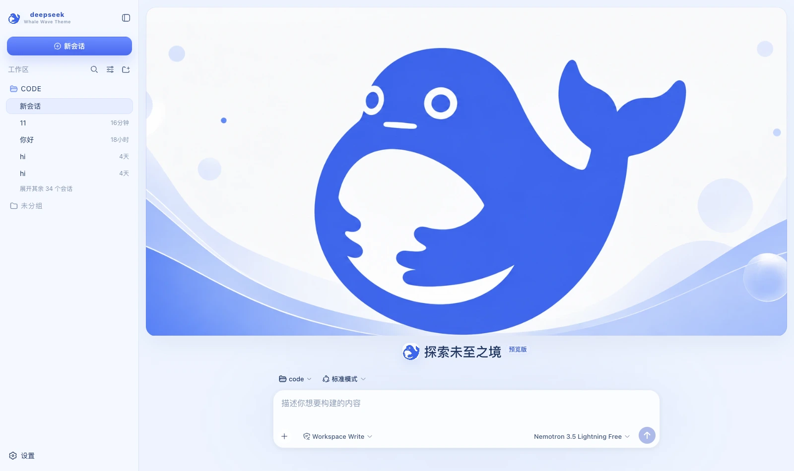

# dsh-whale-wave-banner · Whale Wave Banner

A light skin for DeepSeek Harness (dsh): DeepSeek blue, white and a very pale grey-blue, with a banner cover on the
new-session page and the composer sitting separately below it.



## What it changes

| Surface | Content |
|---|---|
| Palette | A full set of `--dsw-alias-*` / `--dsw-specific-*` semantic tokens on the light base, with every border a pale 1px line tinted blue |
| New session | **The banner takes only the upper half**, as a card with a 20px radius; the composer sits separately below, the two never overlap, and no copy is laid over the cover |
| Brand slots | The sidebar and new-session marks are the banner cropped square (reusing the same inlined image), with the subtitle `Whale Wave Theme` |
| 右侧状态台 | 对话页常驻：缩小版横幅 + 六类真实状态，可收起（记住选择） |

### 🔴 This skin does the opposite of the others

Points 1 and 2 of the implementation notes in the prototype's Appearance panel are the whole point:

> 1. Use this banner image directly at the top of New Session, **laying no block of explanatory copy over the cover**.
> 2. **Place the composer separately below the cover** so the hero visual stays intact.

Its handoff likewise says `hero.copy = none` / `composer = below cover`. So where other skins pin the composer to the
bottom over the full image, this one **must not** — the banner takes all the height above the composer, which sits below it.

(Implementation detail: drawing it at the source ratio `aspect-ratio: 2.5/1` first left the cover shorter than the space available, with a wide gap in the middle that
looked half-loaded. The prototype's `.home` is `grid-template-rows: minmax(0,1fr) auto` — the cover takes all the remaining
height and `object-fit: cover` trims the excess. Filling the space with `background-size: cover` is what finally matched.)

Point 4 is just as binding: **keep the colours to DeepSeek blue, white and a very pale grey-blue**. So this skin has almost no fifth
colour: green appears only for online and success, and even running uses a brighter step of the brand blue rather than a new accent.

### What the status dock shows

| Card | Fields | Source |
|---|---|---|
| Waiting on you | Tools awaiting approval, questions awaiting an answer | `ConversationSnapshot.pending`. **Appears only when something is genuinely waiting** |
| Current Session | State, elapsed turn time, current tool duration, inbox, model | `running` / `turnTimings` / `runningCalls` / `queue`; the model comes from the latest assistant message's `provenance.model` |
| Context | Occupancy %, token load, and the System / tool-schema / conversation composition bar | The `contextPressure` and `contextBreakdown` projections |
| Permission | The active permission and sandbox mode | The `permissions` projection |
| Usage | Input / output / cache hits / time spent / turns | The `tokenUsage` and `sessionStats` projections |
| Plan | Todo progress | The `todos` projection (the card is absent when there is no list) |
| Tool calls | Tool name · real duration · outcome | Trajectory `tool-result` nodes (duration = `time - callTime`) plus the snapshot's `runningCalls`. **Appears only once a call has happened** |
| Context injections | The source and form of each injection | Trajectory `context` nodes (`provenance.label` / `form`) |
| Folded away | Compaction count, items and tokens folded | Trajectory `compaction` nodes. **Absent when nothing was compacted** |

⚠️ **A tool duration may be absent**: it can only be computed while the matching `tool/call` is still inside the session window. Older calls that scrolled past report only name and outcome — better blank than an invented figure.

⚠️ **Composition is not a total**: the three `contextBreakdown` figures use fixed-density estimates (systematically low for Chinese and JSON schema)
and **do not add up** to the token load, which is anchored to the provider's reported value. The UI says so too.

The five "Harness Systems ONLINE" rows in the prototype's right column are pure decoration, and the three `Theme Mode` rows are a hardcoded theme description —
neither is built; nothing is padded out with fake data.

## About the copy

**This skin replaces no host copy.** The prototype gives no agent-copy specification, and inventing personified lines without a basis is embellishment.

## Install

**Skin market** (recommended): search for "Whale Wave", install, then **restart dsh**.

Manual install (during development):

```bash
npm install && npm run build
DST=~/.dsh/profiles/web/node_modules/dsh-whale-wave-banner
mkdir -p "$DST" && cp -R lib cordis.patch.yml skin.json package.json README.md "$DST/"
# then add dsh-whale-wave-banner to the profile package.json's dependencies and dsh.profile.bundles
```

After changing it you **must restart dsh**: the profile tree has to be recomposed, and without a restart the UI stays as it was.

## 🔴 The side effect of autoApply

Installing switches to this skin by default (`autoApply`, default `true`). The reason is that the harness **does not persist third-party theme ids**,
and the **built-in Settings → Appearance has only three cells: light / dark / follow system**, with no third-party themes —
switching manually requires the skin market's own panel (**Settings → Skin Market**).

The cost: **it reapplies on every refresh**, so switching away lasts only for that session. To change permanently, set `autoApply` to `false`
or uninstall this plugin.

## Version requirements

Requires **dsh 0.1.1-rc.2 or newer**. The brand-slot takeover relies on slot `priority` shadowing; on older versions
those three registrations throw and the error is swallowed — it **simply falls back to the official brand mark**, while the palette and banner keep working.

## Assets

The banner is a 1983×793 illustration compressed to webp (q92) at just **56 KB** — flat colour compresses far better than photographic art.
The prototype embeds the same image three times (cover / brand mark / avatar, identical md5, 1.08 MB each); only one copy is inlined here, with
the brand mark cropped square from the centre.

## Development

```bash
npm run check   # tsc --noEmit
npm run build   # produces lib/index.js (host half) and lib/client.js (browser half)
```

`lib/` **要提交进仓库**：皮肤靠 `github:owner/repo` 安装，装的是仓库里的构建产物。

## License

MIT © Science Roam Limited
