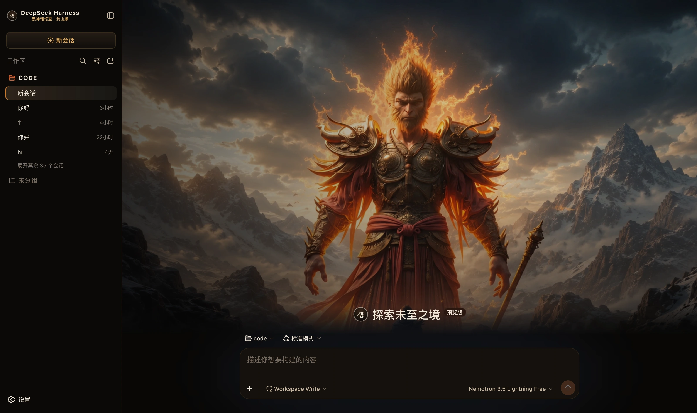

# dsh-wukong-flame-mountain · Black Myth Wukong · Flame Mountain

A dark skin for DeepSeek Harness (dsh): black ink, old gold and ember orange, with a full-bleed Flame Mountain visual on the new-session page.



## What it changes

| Surface | Content |
|---|---|
| Palette | A full set of `--dsw-alias-*` / `--dsw-specific-*` semantic tokens on the dark base, plus a global 170px warp-and-weft texture |
| New session | A full landscape visual of the flame-haired Wukong with the composer at the bottom. **Strong character visuals appear on the empty screen only** — they collapse on entering a conversation |
| Brand slots | The sidebar and new-session marks become a gold seal bearing the character 悟, with the subtitle `Black Myth Wukong · Flame Mountain` |
| 右侧状态台 | 对话页常驻：缩小版主视觉 + 六类真实状态，可收起（记住选择） |
| Identity copy | Thinking → "Thinking…", failure → "Execution failed, please retry." |

### 🔴 The ratios are fixed by the draft

> 72% black ink / 14% dark brown surface / 8% old gold / 3% bronze / 2% ember orange / 1% danger red

This is not a swatch but a **usage constraint**, held to line by line:

- **Old gold** goes to the primary action and the brand slots only, never across a surface;
- **Ember orange** goes only to the running semantic (`state-business-*`) — the rarer it is, the more the running signal means;
- even **`+ New session` is not solid gold** (in the prototype it is gold text and border on a dark ground); solid gold belongs to Send alone;
- the identity copy is deliberately restrained: the draft says twice to avoid over-stylised wording and to take over only
  the visual character and a little identity copy, with interaction, information architecture and permission logic still following DeepSeek Harness.

### What the status dock shows

| Card | Fields | Source |
|---|---|---|
| Waiting on you | Tools awaiting approval, questions awaiting an answer | `ConversationSnapshot.pending`. **Appears only when something is genuinely waiting** |
| Current Session | State, elapsed turn time, current tool duration, inbox, model | `running` / `turnTimings` / `runningCalls` / `queue`; the model comes from the latest assistant message's `provenance.model` |
| Context | Occupancy %, token load, and the System / tool-schema / conversation composition bar | The `contextPressure` and `contextBreakdown` projections |
| Permission | The active permission and sandbox mode | The `permissions` projection |
| Usage | Input / output / cache hits / time spent / turns | The `tokenUsage` and `sessionStats` projections |
| Plan | Todo progress | The `todos` projection (the card is absent when there is no list) |
| Tool calls | Tool name · real duration · outcome | Trajectory `tool-result` nodes (duration = `time - callTime`) plus the snapshot's `runningCalls`. **Appears only once a call has happened** |
| Scroll injection | The source and form of each context injection | Trajectory `context` nodes (`provenance.label` / `form`) |
| Folded away | Compaction count, items and tokens folded | Trajectory `compaction` nodes. **Absent when nothing was compacted** |

⚠️ **A tool duration may be absent**: it can only be computed while the matching `tool/call` is still inside the session window. Older calls that scrolled past report only name and outcome — better blank than an invented figure.

⚠️ **Composition is not a total**: the three `contextBreakdown` figures use fixed-density estimates (systematically low for Chinese and JSON schema)
and **do not add up** to the token load, which is anchored to the provider's reported value. The UI says so too.

The prototype's `Workspace context` (which files are indexed) has no matching projection in the harness, and
`Keyboard` is a static cheat sheet — neither is built, and no fake data fills the space.

## Install

**Skin market** (recommended): search for "Wukong" in dsh's skin market and install, then **restart dsh**.

Manual install (during development):

```bash
npm install && npm run build
DST=~/.dsh/profiles/web/node_modules/dsh-wukong-flame-mountain
mkdir -p "$DST" && cp -R lib cordis.patch.yml skin.json package.json README.md "$DST/"
# then add dsh-wukong-flame-mountain to ~/.dsh/profiles/web/package.json's dependencies and dsh.profile.bundles
```

After changing it you **must restart dsh**: the profile tree has to be recomposed, and without a restart the UI stays as it was.

## 🔴 The side effect of autoApply

Installing switches to this skin by default (`autoApply`, default `true`). The reason is that the harness **does not persist third-party theme ids**,
and the **built-in Settings → Appearance has only three cells: light / dark / follow system**, with no third-party themes —
switching manually requires the skin market's own panel (**Settings → Skin Market**).

The cost: **it reapplies on every refresh**, so switching away lasts only for that session. To change permanently, set `autoApply` to `false`
or uninstall the plugin. It is implemented as an 8-second window after startup (long enough to outlast the Host preference snapshot), after which it lets go entirely.

## What cannot be done

- **The hero's headline** (the prototype sets it in a brush serif): the harness's empty-screen heading comes from the
  built-in locale, and a third-party `locale.register` throws on a duplicate name — addition only, never replacement. Forcing a pseudo-element over it would cover every other language too,
  so the host's own text stays.
- The prototype's right-column cards (Workspace context / Keyboard): see above.

## Version requirements

Requires **dsh 0.1.1-rc.2 or newer**. The brand-slot takeover relies on slot `priority` shadowing; on older versions
these three registrations throw and are swallowed, **merely falling back to the official brand mark**, while the palette and hero keep working.

## Assets

The hero is a 1672×941 illustration compressed to webp (q92, 307 KB) and inlined into the bundle rather than linked from an image host —
from an image host — it has to work offline and on an intranet. How it is generated and its resolution ceiling are documented at the top of `src/client/cover.generated.ts`.

## Development

```bash
npm run check   # tsc --noEmit
npm run build   # produces lib/index.js (host half) and lib/client.js (browser half)
```

`lib/` **must be committed**: skins install via `github:owner/repo`, which installs the build output from the repository;
if the source moves and the output does not, people install the old version (and the market uninstalls the package outright over the missing entry file).

## License

MIT © Science Roam Limited
